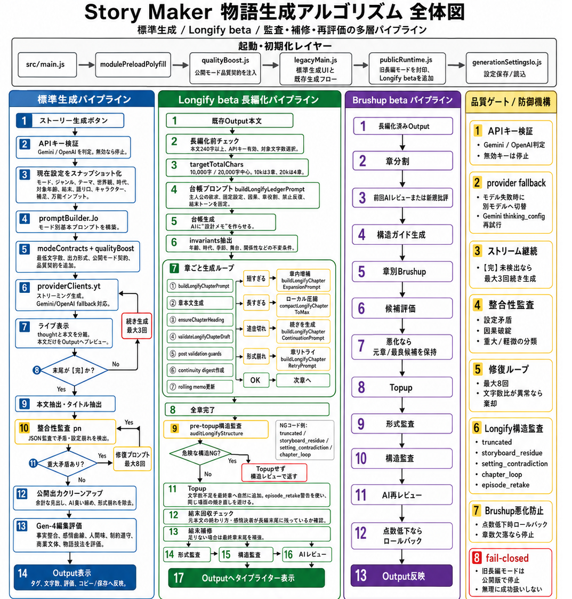

# Story Maker v5.4.2 / AI物語メーカー

> **Source code available; free to use.** Ordinary use, free integration and free provision require no application, prior contact or permission from FURU. You may sell and monetize your own works. External API costs and third-party terms are separate. See Terms & Output Rights below. / **ソースコード公開・利用無料。** 通常利用と無料の組み込み・無料提供に、申請・事前連絡・FURUの許可は不要です。自分の作品は販売・収益化できます。外部API料金と第三者の条件は別です。詳しくは「利用条件・作品の権利」をご確認ください。


[](https://youtu.be/pqYVxUUg0Cs?si=27g1I3tO2EuZkOuxJ)

Story Maker is a static web application for generating creative text with Google Gemini API or OpenAI API. Its 15 public output modes include direct `Long-form (10,000 characters+)` generation, and every supported Output can receive an AI editorial score and guarded brush-up. It is not a plain prompt box. It combines output mode, theme, genre, worldview, audience, era, ending style, narration, characters, source material, optional image input, and optional style analysis into a structured generation contract. / Story Maker は、Google Gemini API または OpenAI API を使って創作文を生成する静的Webアプリです。15の公開出力モードには「長編（10000字～）」の直接生成が含まれ、対応するすべてのOutputでAI編集採点と安全判定付きブラッシュアップを使えます。単なるプロンプト入力欄ではなく、出力モード、テーマ、ジャンル、世界観、読者層、時代、結末、語り口、登場人物、素材入力、画像入力、作風解析を組み合わせて、生成用の契約を組み立てます。

## API Key Safety / APIキーの安全性

API keys are entered by the user in the browser UI. The repository, README, release notes, release assets, and public static files must not contain API keys, private credentials, billing data, or personal secrets. / APIキーはユーザーがブラウザUIへ入力します。リポジトリ、README、リリースノート、リリース成果物、公開静的ファイルには、APIキー、秘密資格情報、課金情報、個人的な秘密情報を含めてはいけません。

API keys are kept only in the active page memory and are cleared on reload or when the page closes. They are not stored in `localStorage`, `sessionStorage`, or `window.name`. Keys are sent only to the selected provider when an API request is made for generation, image understanding, style analysis, or news-grounded keyword assistance. Story Maker does not send API keys to the repository, issue tracker, release system, documentation, or unrelated external services. URL body fetching through third-party proxy services is disabled; paste source text directly instead. See [PRIVACY.md](./PRIVACY.md) for the full policy. / APIキーはアクティブなページのメモリだけに保持され、リロードまたはページを閉じると消えます。`localStorage`、`sessionStorage`、`window.name` には保存しません。生成、画像理解、作風解析、ニュース接地キーワード補助などで必要なAPIリクエストを行う時だけ、選択中のAPI提供元へ送信されます。Story Maker は、APIキーをリポジトリ、Issue、リリース管理、公開文書、無関係な外部サービスへ送信しません。URL本文の取得に第三者公開プロキシは使用しないため、素材本文は直接貼り付けてください。詳しくは [PRIVACY.md](./PRIVACY.md) を参照してください。

Do not paste API keys into issues, pull requests, release notes, screenshots, public documents, or chat logs. / APIキーを Issue、Pull Request、リリースノート、スクリーンショット、公開文書、チャットログへ貼らないでください。

## Core Concept / 基本コンセプト

The app builds a generation request from multiple visible axes instead of relying on one free-form prompt. The goal is to move generated stories away from the similar, overly neat, AI-like patterns that often appear by default, and toward outputs that at least pursue a decent level of interestingness through concrete conflict, timing, texture, and mode-specific endings. / このアプリは、自由入力だけに頼らず、複数の見える創作軸から生成リクエストを組み立てます。狙いは、AI特有の似たり寄ったりで整いすぎたストーリーから離れ、短時間の生成でも、具体的な葛藤、間、手触り、モードごとの締めによって、そこそこ面白いところを追求することです。



Main axes: / 主な創作軸:

- output mode / 出力モード
- theme or seed / テーマまたはシード
- characters / 登場人物
- genre / ジャンル
- worldview or setting / 世界観・舞台
- audience / 読者層
- era / 時代
- ending style / 結末
- narrator or point of view / 語り口・視点
- universal input text or image material / 万能インプットのテキストまたは画像素材
- supplemental user constraints / 補足メモ
- optional style analysis / 任意の作風解析

### How Request Assembly Works / 生成条件の組み立て

Story Maker treats each visible selection as a separate creative constraint. The final request is assembled from the selected output form, the story seed, the genre pressure, the setting logic, the audience level, the era, the ending shape, the narrative voice, the characters, the universal input, and any style-analysis result. This makes the request easier to inspect than one large hidden prompt. / Story Maker は、画面上の各選択を別々の創作条件として扱います。最終リクエストは、出力形式、物語の種、ジャンル圧、舞台論理、読者層、時代、結末型、語り口、登場人物、万能インプット、作風解析結果を組み合わせて作られます。巨大な隠しプロンプト一つに任せるより、どの条件が効いているかを確認しやすくするためです。

The intent is not to force every work into the same template. The contract tells the model what shape must be preserved, while the selected axes decide the content, conflict, tone, and texture. / 目的は、すべての作品を同じ型へ押し込むことではありません。契約は守るべき形を指定し、選択軸が内容、葛藤、トーン、質感を決めます。

## Feature Map / 機能マップ

| Area / 領域 | Feature / 機能 | Details / 詳細 |
|---|---|---|
| API / API | Gemini / OpenAI switching / Gemini / OpenAI 切り替え | Switch the selected provider from the UI while keeping the visible creative settings. / 画面上の創作設定を保ったまま、利用するAPI提供元を切り替えます。 |
| API / API | Runtime key entry / 実行時キー入力 | API keys are typed into the browser UI by the user and must not be committed or published. / APIキーはユーザーがブラウザUIへ入力し、リポジトリや公開物へ含めません。 |
| API / API | Provider links / キー取得リンク | Header links help the user reach Gemini API and OpenAI API key pages. / ヘッダーから Gemini API と OpenAI API のキー取得ページへ移動できます。 |
| Generation / 生成 | 15 public output modes / 15公開出力モード | Each public mode has its own expected structure and cleanup behavior. The public set includes direct `Long-form (10,000 characters+)` generation. / 各公開モードには、期待される構造と整形処理があります。公開モードには直接生成の「長編（10000字～）」も含まれます。 |
| Generation / 生成 | Selected-mode priority / 選択モード優先 | The selected output chip wins over incidental words inside prompts or source material. / プロンプトや素材文中の偶然の語より、選択中の出力チップを優先します。 |
| Generation / 生成 | Direct long-form generation / 長編の直接生成 | `Long-form (10,000 characters+)` creates one complete long manuscript directly from the selected settings. It is separate from the sealed legacy chapter-by-chapter long-novel mode. / 「長編（10000字～）」は、選択中の設定から一つの完結した長編原稿を直接生成します。封印中の旧章単位長編モードとは別経路です。 |
| Randomization / ランダム | All-random / 全項目ランダム | Randomizes the visible creative axes and starts generation immediately. / 見えている創作軸をまとめてランダム化し、そのまま生成します。 |
| Randomization / ランダム | Per-section random / セクション別ランダム | Individual sections can be randomized without changing the whole request. / 全体を変えず、特定セクションだけを個別にランダム化できます。 |
| Locking / 固定 | Section locks / セクションロック | Locked sections are protected from randomization and reset where applicable. / ロックした欄は、対応するランダム化やリセットから保護されます。 |
| Characters / 人物 | Character count controls / 人数調整 | Add or remove character slots with plus/minus controls. / プラス/マイナスで登場人物枠を増減できます。 |
| Characters / 人物 | Manual character fields / 手動項目 | Name, sex, role, personality, and notes can be edited per character. / 名前、性別、役割、性格、メモを人物ごとに編集できます。 |
| Characters / 人物 | Character randomization / 人物ランダム | Randomize current character content, or randomize count plus content. / 現在人数のまま内容だけ、または人数込みで人物をランダム生成できます。 |
| Characters / 人物 | Character sheet image import / キャラクターシート画像 | Drop PNG/JPG/WEBP character sheets and convert visible traits into character settings. / PNG/JPG/WEBP画像から人物情報を読み取り、設定へ反映します。 |
| Intake / 素材 | Universal Input / 万能インプット | Add text, Markdown, URLs, local text files, and images as story context. / テキスト、Markdown、URL、ローカルテキスト、画像を文脈として投入できます。 |
| Intake / 素材 | Asset list / 素材一覧 | Added materials can be reviewed and cleared from the intake area. / 追加した素材を一覧で確認・クリアできます。 |
| News / ニュース | News keywords / ニュースキーワード | Gemini search grounding can turn current Japanese news topics into creative seeds. / Gemini検索グラウンディングで日本語ニュース話題を創作の種にできます。 |
| Style / 作風 | Style analyzer / 作風解析 | Analyze text or images into writing-style parameters. / テキストや画像から文体パラメータを抽出します。 |
| Style / 作風 | JSON export / JSON出力 | Export style analysis as structured JSON for external writing workflows. / 作風解析結果を外部の文章ワークフロー向けJSONとして出力できます。 |
| Style / 作風 | Style rewrite / 作風リライト | Rewrite generated output using the analyzed style while keeping the plot direction. / 生成済み出力の筋を保ったまま、解析した文体で書き換えます。 |
| Output / 出力 | Character counter / 文字数表示 | Output area shows current character count. / 出力欄で現在の文字数を表示します。 |
| Output / 出力 | Tags / タグ表示 | Output tags show selected provider/model/mode and major generation axes. / API、モデル、モード、主要軸をタグとして表示します。 |
| Output / 出力 | Copy and text export / コピーとテキスト出力 | Generated text can be copied or exported as a timestamped `.txt` file. / 生成結果をコピーまたはタイムスタンプ付き `.txt` として書き出せます。 |
| Progress / 進捗 | Thought log / 思考ログ | Shows progress messages while API communication is running. / API通信中の進行メッセージを表示します。 |
| Quality / 品質 | Mode contracts / モード契約 | Each public mode receives a required output shape. / 公開モードごとに必須の出力形を指定します。 |
| Quality / 品質 | Short-draft rewrite / 短すぎる初稿の改稿 | Too-short public drafts are rewritten before they are accepted as final output. / 公開モードの初稿が短すぎる場合、最終採用前に改稿します。 |
| Quality / 品質 | Universal AI review and brush-up / 全モードAI講評・ブラッシュアップ | Every generated, pasted, or imported manuscript receives a three-tier AI review and guarded rewrite: 90+ editorial pass, 85–89 publishable with optional brush-up, and 84 or below needs brush-up. / 生成・貼り付け・インポートしたすべての原稿を三段階でAI採点し、安全判定付きで改稿できます。90点以上は編集合格、85〜89点は公開可能・任意ブラッシュアップ、84点以下は要ブラッシュアップです。 |
| Quality / 品質 | Final cleanup / 最終出力整形 | Prompt artifacts, stale completion markers, and unreadable endings are cleaned before display. / プロンプト断片、古い完了マーカー、読みにくい終端を表示前に整えます。 |
| Quality / 品質 | Completion gates / 完走ゲート | Mode-specific endings such as final 4-koma scenario aim and documentary closing labels are checked or restored. / 4コマシナリオ末尾の狙い、ドキュメンタリーの締めなど、モード固有の終端を確認・復元します。 |

## Technology Highlights / 技術ハイライト

Story Maker is designed as a small static application, but the generation pipeline is closer to a creative-control engine than a single textarea. The technical value is in how the app converts visible user choices into a stable, provider-aware writing contract. / Story Maker は小さな静的Webアプリとして動きますが、生成パイプラインは単一のテキスト欄ではなく、創作制御エンジンに近い構造です。技術的な価値は、画面上の選択を、API提供元ごとの癖まで考慮した安定した文章生成契約へ変換する点にあります。

### Release Safety / 公開時の安全ゲート

For maintainers, deployment is not treated as release completion. The deploy command first checks a versioned release-note file with paired English/Japanese item IDs, then builds the app. After publication, the release verifier requires GitHub Pages to report `built`, to point to the expected commit, and for the public page to show the requested version. A `building`, failed, stale, or unreachable page remains an incomplete release. / 保守者向けには、デプロイ実行だけをリリース完了と扱いません。デプロイ前に、英日で対応する項目IDを持つ版別リリースノートを検査し、本番ビルドを行います。公開後は、GitHub Pages が `built` であること、対象コミットと一致すること、公開ページに対象バージョンが表示されることを確認します。`building`、失敗、古い表示、到達不能のページはリリース未完了です。

### Multi-Axis Prompt Compiler / 多軸プロンプトコンパイラ

The app compiles many independent axes into one request: output mode, theme, genre, worldview, target reader, era, ending type, narration, characters, source material, supplemental constraints, and optional style-analysis results. This reduces the risk that one vague prompt will collapse into a generic summary. / このアプリは、出力モード、テーマ、ジャンル、世界観、読者層、時代、結末型、語り口、登場人物、素材、補足条件、任意の作風解析結果をまとめて一つのリクエストへコンパイルします。曖昧な一文プロンプトが、ありがちな要約文へ崩れるリスクを下げるためです。

The compiler keeps form and content separate. Output mode decides the finished shape, while the other axes decide material, tone, conflict, reader distance, and ending pressure. / コンパイラは「形式」と「内容」を分けて扱います。出力モードが完成形を決め、その他の軸が素材、トーン、葛藤、読者との距離、結末圧を決めます。

### Provider Adapter Layer / API別アダプタ層

Gemini and OpenAI are not treated as identical black boxes. They receive the same public-mode intent, but the app adjusts the delivery. Gemini receives extra pressure against tidy explanation, bland summary, and short closure. OpenAI receives stricter system-level mode constraints and stronger suppression of analysis fragments. The goal is to make both providers produce usable public-mode writing from the same UI. / Gemini と OpenAI を同じ黒箱として扱いません。同じ公開モード意図を渡しつつ、渡し方を調整します。Gemini には、整いすぎた説明、無難な要約、短い締めを避ける圧を追加します。OpenAI には、system レベルでモード制約を強く入れ、分析断片の混入を抑えます。同じUIから、両APIで使える文章を出すための層です。

### Multimodal Intake / マルチモーダル素材取り込み

The app can use text, Markdown, local text files, URLs, pasted notes, and supported images as source material. Character-sheet images and universal image input are converted into usable writing context instead of remaining as decorative attachments. / テキスト、Markdown、ローカルテキストファイル、URL、貼り付けメモ、対応画像を素材として扱えます。キャラクターシート画像や万能インプットの画像は、単なる添付物ではなく、文章生成に使える文脈へ変換されます。

### Style Analyzer And Rewrite Engine / 作風解析とリライトエンジン

The style analyzer extracts reusable writing-style signals from user-provided text or images. It can produce a readable analysis, structured JSON for external workflows, and a rewrite that keeps the generated plot direction while changing rhythm, diction, density, sensory focus, and tone. / 作風解析は、ユーザーが与えた文章や画像から再利用できる文体信号を抽出します。読みやすい解析、外部ワークフロー向けの構造化JSON、生成済み本文の筋を保ったままリズム、語彙、密度、感覚描写、トーンを変えるリライトを出せます。

### Human-Texture Writing Controls / 人間味を出す文章制御

The quality layer does not only ask for "better writing." It pushes for specific craft signals: concrete action, uneven reaction, silence, physical sensation, relationship change, aftermath, information order, and a last line that changes or concentrates the meaning. These rules are kept generic so they work across many themes instead of depending on one fixed scenario. / 品質レイヤーは、単に「良い文章にして」と頼むだけではありません。具体的な行動、均一でない反応、沈黙、身体感覚、関係変化、後始末、情報開示の順番、意味を反転または凝縮する最後の一文など、文章の手触りを作る要素を要求します。これらは固定シナリオに依存しない汎用ルールとして保ちます。

### Rewrite And Cleanup Pipeline / 改稿・整形パイプライン

Generated text passes through public-mode checks before it is treated as final. Too-short drafts can be rewritten by the selected provider. Final cleanup removes prompt residue, stale completion markers, analysis fragments, and awkward endings while preserving mode-specific readability such as poem line breaks, letter paragraphs, manga panel boundaries, and script labels. / 生成本文は、最終出力として扱う前に公開モード用の検査を通ります。短すぎる初稿は、選択中のAPIで改稿できます。最終整形では、プロンプト残骸、古い完了マーカー、分析断片、不自然な終端を取り除きつつ、詩の行分け、手紙の段落、漫画のコマ境界、脚本ラベルなど、モードごとの読みやすさを守ります。

### Static Safety And Release Discipline / 静的公開と安全管理

The app is built for static hosting. Normal use does not require a custom backend, server-side account system, or repository writes. Public build checks also strip dormant unsupported controls, scan for non-generic rule leakage, and keep API keys, generated text, billing data, and private credentials out of release-facing files. / このアプリは静的ホスティングを前提にしています。通常利用に専用バックエンド、サーバー側アカウント、リポジトリへの書き込みは必要ありません。公開ビルドの確認では、休止中の非対応UIを除去し、非汎用ルールの混入を検査し、APIキー、生成本文、課金情報、秘密資格情報を公開向けファイルへ入れないようにしています。

## Supported Public Output Modes / 対応公開出力モード

The public release supports the following 15 output modes. Each mode has a mode contract, so the label is not decorative: the generated text is expected to follow the shape of that mode. / 公開版では次の15モードに対応します。各モードには出力契約があり、単なるラベルではありません。生成本文は、そのモードに合った形で出力されます。

| Mode / モード | Japanese Label / 日本語ラベル | Expected Output Shape / 想定出力形式 |
|---|---|---|
| `4koma` | 4コマ漫画風 | Four-panel beat structure with setup, turn, punchline, visual action, and dialogue. / 導入、展開、オチ、視覚的な動き、セリフで構成する4コマ形式です。 |
| `4koma_scenario` | AI 4koma シナリオ連携（STEP2） | Topic, logline, location, outfit, punchline, scenario notes, and four panel blocks with emotion/camera/dialogue cues. / テーマ、ログライン、場所、服装、オチ、シナリオメモと、感情・カメラ・セリフを含む4コマ分のブロックを出力します。 |
| `short_short` | ショート（1500字～） | Compact prose with setup, turn, aftertaste, and a final line that changes the meaning. / 導入、転換、余韻を備え、最後の一文で意味が変わる短い物語です。 |
| `novel` | 短編小説（4500字～） | Scene-based short fiction with desire, obstacle, choice, cost, and relationship change. / 欲求、障害、選択、代償、関係性の変化を場面で描く短編小説です。 |
| `medium` | 中編小説（5500字～） | Three-section prose with stronger development, scene movement, and a larger emotional arc. / 展開、場面の推移、感情の変化を厚く描く3節構成の中編小説です。 |
| `long_10000` | 長編（10000字～） | One complete long-form manuscript generated directly from the selected premise, with a 10,000 non-whitespace body-character minimum and a finished ending. / 選択した前提から直接生成する完結した長編原稿です。空白を除く本文10,000字以上と、物語として完結した結末を必須とします。 |
| `scenario` | 脚本/台本 | `タイトル:`, `登場人物:`, `場面:` plus stage directions and character-name dialogue. / `タイトル:`、`登場人物:`、`場面:`に加え、ト書きと役名付きのセリフを出力します。 |
| `manga` | ストーリー漫画 | Page and panel descriptions, separated `絵:`, `セリフ:`, and `演出:` details. / ページ・コマごとの説明を、`絵:`、`セリフ:`、`演出:`に分けて出力します。 |
| `essay` | エッセイ | Claim, observation, reflection, and conclusion without escaping into incident-resolution fiction. / 出来事を解決する物語へ逃げず、主張、観察、考察、結論を組み立てます。 |
| `poem` | 詩・ポエム | Title plus line-based poetic output with concrete images and no explanatory afterword. / 題名と行単位の詩本文を出力し、具体的なイメージを用い、説明的な後書きは付けません。 |
| `fairy` | 童話/絵本 | Gentle story form with visible action, lesson-like change, and child-readable clarity. / 目に浮かぶ行動、教訓につながる変化、子どもにも読みやすい明快さを備えた物語です。 |
| `letter` | 手紙/書簡体 | `宛先:`, paragraphized body, closing, sender, and relationship change through written voice. / `宛先:`、段落を分けた本文、結び、差出人を含め、書かれた言葉を通じた関係性の変化を描きます。 |
| `diary` | 日記/独白体 | Date-like or diary-like first-person reflection with self-deception and a small truth. / 日付や日記らしい形式で、自己欺瞞と小さな真実を含む一人称の内省を描きます。 |
| `documentary` | ドキュメンタリー | `ナレーション:`, testimony, observation, unresolved question, and factual-feeling structure. / `ナレーション:`、証言、観察、未解決の問いを用い、事実を追うような構成にします。 |
| `radio` | ラジオドラマ | `BGM:`, `SE:`, narration, dialogue, and sound-driven scene movement. / `BGM:`、`SE:`、ナレーション、セリフを用い、音を軸に場面を展開します。 |

### Mode Behavior / モード別の動作

- Narrative modes prioritize setup, conflict, payoff, character function, scene motion, and emotional landing. / 物語系モードでは、導入、葛藤、回収、人物機能、シーンの動き、感情の着地を重視します。
- Comedy and 4-panel modes emphasize expectation gaps, misdirection, reversal, and punchline timing. / コメディ/4コマ系では、期待とのズレ、ミスリード、反転、オチのタイミングを重視します。
- Script, manga, documentary, and radio modes prioritize readable labels and production-friendly units. / 脚本、漫画、ドキュメンタリー、ラジオでは、制作に使いやすいラベルと単位を重視します。
- Essay, poem, letter, and diary modes protect their form instead of forcing story-like foreshadowing. / エッセイ、詩、手紙、日記では、物語風の伏線を無理に足すより、その形式自体を守ります。
- All modes reject visible prompt analysis, self-evaluation, checklist fragments, and unfinished planning notes. / すべてのモードで、見える本文中のプロンプト分析、自己評価、チェックリスト断片、未完成の設計メモを拒否します。

## Direct Long-Form And Universal Brush-Up / 長編直接生成と全モード共通ブラッシュアップ

The current public long-form design has two clearly separated parts. `Long-form (10,000 characters+)` is a normal output chip that generates one complete long manuscript directly from the selected settings. The section below Output is no longer a Longify expansion tool: it is a universal AI editorial review and brush-up tool for every public output mode. / 現在の公開版の長編機能は、二つの役割に分かれています。「長編（10000字～）」は通常の出力チップで、選択中の設定から一つの完結した長編原稿を直接生成します。Output下のコーナーは長編化ツールではなく、全公開モードで使えるAI講評・ブラッシュアップ機能です。

### At A Glance / 全体像

| Topic / 項目 | Current behavior / 現行動作 |
|---|---|
| Direct long-form / 長編直接生成 | Select `Long-form (10,000 characters+)` before generation. The app requests one completed long manuscript and validates a 10,000+ non-whitespace body-character minimum and a closed ending. / 生成前に「長編（10000字～）」を選びます。一つの完結した長編として生成し、空白を除く本文10,000字以上と完結した終端を検証します。 |
| Universal review / 全モードAI講評 | After any supported mode finishes, the selected provider reviews the visible Output and shows a 0–100 score, a three-tier state, and paragraph-preserving commentary: 90+ editorial pass, 85–89 publishable, 84 or below needs brush-up. / 対応モードの生成完了後、選択中のAPIが表示中Outputを読み、0～100点、三段階判定、段落を保持した講評を表示します。90点以上は編集合格、85〜89点は公開可能、84点以下は要ブラッシュアップです。 |
| Universal brush-up / 全モードブラッシュアップ | `この小説をブラッシュアップ` rewrites the current Output in its active output format. It can also use text pasted into Output or imported from TXT/MD. / 「この小説をブラッシュアップ」は、現在のOutputを選択中の出力形式のまま改稿します。Outputへ貼り付けた本文やTXT/MDからインポートした本文にも使えます。 |
| Legacy path / 旧長編経路 | The old chapter-by-chapter `long` mode and its long-novel control panel remain sealed and are not the supported public route. / 旧章単位の `long` モードと長編小説コントロールパネルは封印中で、公開版の利用経路ではありません。 |
| Posting previews / 投稿補助 | Kakuyomu-style and Alphapolis-style previews read the latest Output independently of review and brush-up. / Kakuyomuフォーム風・アルファポリスフォーム風プレビューは、講評・ブラッシュアップとは別に最新Outputを読み取ります。 |

### Recommended Workflow / 推奨手順

1. Choose an output mode. For a new long manuscript, select `Long-form (10,000 characters+)`. / 出力モードを選びます。新しい長編を作る場合は「長編（10000字～）」を選びます。
2. Set the theme, genre, worldview, audience, ending, narration, characters, and optional source material. / テーマ、ジャンル、世界観、読者層、結末、語り口、登場人物、必要なら素材を設定します。
3. Generate the manuscript, or paste/import an existing manuscript into Output. / 原稿を生成するか、既存原稿をOutputへ貼り付け／TXT・MDインポートします。
4. Read the automatically displayed AI score and commentary. / 自動表示されるAI点数と講評を確認します。
5. Leave automatic brush-up on for up to three attempts toward the 100-point target, or turn it off to run exactly one rewrite per click. A score of 90 or higher passes. / 84点以下だけを最大3回まで自動ブラッシュアップできます。85〜89点は公開可能で、必要なときだけ手動ブラッシュアップを使います。90点以上は編集合格です。
6. Review the retained Output, then copy, save as TXT, or use the posting previews. / Outputに保持された原稿を確認し、コピー、TXT保存、投稿プレビューを使います。

### Display And Controls / 表示と操作

| UI element / UI要素 | Behavior / 動作 |
|---|---|
| Status line / 状態表示 | Shows review acquisition, pass, needs brush-up, completion score, or failure with manuscript preservation. / 講評取得中、合格、要ブラッシュアップ、完了点数、または元原稿保持を伴う失敗を表示します。 |
| Score card / 点数カード | Uses a full-width card with a large score, `/100`, pass/needs-brush-up label, score bar, and optional attempt count. / 全幅カードに大きな点数、`/100`、合格／要ブラッシュアップ、スコアバー、必要に応じて実行回数を表示します。 |
| Commentary / 講評 | Preserves paragraphs and line breaks so concrete revision advice remains readable instead of becoming one dense line. / 具体的な改稿指示が一行に潰れないよう、段落と改行を保持して表示します。 |
| Brush-up button / ブラッシュアップボタン | Disabled until Output contains a usable manuscript of at least 20 visible characters. While running, settings are protected from conflicting changes. / Outputに20文字以上の利用可能な原稿が入るまで無効です。実行中は競合する設定変更を防ぎます。 |
| Automatic checkbox / 自動チェック | ON: automatically rewrites only manuscripts at 84 or below, stopping once the retained score reaches 85 or after three attempts. OFF: performs one rewrite attempt per click; scores from 85 to 89 remain available for optional manual brush-up. / ON: 84点以下だけを自動改稿し、保持点が85点に達するか最大3回で停止します。OFF: クリックごとに1回だけ改稿します。85〜89点は公開可能として任意の手動ブラッシュアップを使えます。 |

### Review And Adoption Pipeline / 講評・採用パイプライン

| Step / 手順 | What happens / 処理 | Safety purpose / 安全目的 |
|---|---|---|
| 1. Read Output / Output読解 | Reads the currently visible generated, pasted, or imported manuscript and the active output mode. / 表示中の生成・貼り付け・インポート原稿と、選択中の出力モードを読み取ります。 | Keeps the review tied to the manuscript the user can actually see. / ユーザーが実際に見ている原稿を講評対象に固定します。 |
| 2. AI review / AI講評 | Requests a structured score and concrete commentary from the selected provider. If the review format is invalid, it retries once with stricter format instructions. / 選択中のAPIへ構造化された点数と具体的講評を求めます。形式不正なら、形式指定を強めて1回再取得します。 | No local placeholder score is shown as a real review. / ローカルの仮点数を実講評として表示しません。 |
| 3. Rewrite / 改稿 | Sends the current manuscript, active mode, current score, and commentary to the selected provider, requesting completed manuscript text only. / 現在の原稿、出力モード、点数、講評を選択中APIへ渡し、完成稿本文だけを求めます。 | Preserves the subject, characters, facts, ending, and output format while targeting diagnosed weaknesses. / 主題、人物、事実、結末、出力形式を保ち、指摘された弱点だけを直します。 |
| 4. Re-review / 再講評 | Scores the rewrite before it can replace Output. / 改稿候補がOutputを置き換える前に再採点します。 | A rewrite is not accepted merely because an API returned text. / APIが文章を返しただけでは採用しません。 |
| 5. Candidate gate / 候補採用判定 | Adopts only a format-valid, completed, non-duplicated candidate whose score is higher than the retained manuscript. / 形式が正しく、完結し、段落重複がなく、保持中原稿より高得点の候補だけを採用します。 | Prevents a polished-looking regression from overwriting a better draft. / 見た目だけ整った劣化稿が良い原稿を上書きするのを防ぎます。 |
| 6. Continue or stop / 継続／停止 | With auto mode ON, repeats only while the retained score is 84 or below, stopping at 85 or after three attempts. Completion distinguishes editorial pass (90+), publishable (85–89), and needs brush-up (84 or below). / 自動ONでは保持点が84点以下の間だけ改稿し、85点到達または3回実行で停止します。完了時は「編集合格（90点以上）」「公開可能（85〜89点）」「要ブラッシュアップ（84点以下）」を分けて表示します。 | Gives a bounded quality loop and reports the appropriate publication state. / 上限付きの品質ループにし、公開判断に使える状態を明示します。 |

### Manuscript Protection / 原稿保護

| Risk / リスク | Result / 結果 |
|---|---|
| API or review failure / API・講評失敗 | Output is restored to the manuscript present before the brush-up began, and the review card states that the manuscript was preserved. / ブラッシュアップ開始前の原稿をOutputへ戻し、講評カードにも原稿保持を表示します。 |
| Lower or invalid score / 点数低下・採点不正 | The candidate is rejected because it did not prove an improvement. / 改善を証明できないため候補を破棄します。 |
| Major content loss / 大幅な本文消失 | For any source of 500+ characters, a candidate below 60% of the current manuscript length is rejected. / 500文字以上の元原稿では、現在原稿の60%未満まで短縮した候補を破棄します。 |
| Incomplete ending / 未完の終端 | Candidates ending in continuation markers, unfinished sentences, or unclosed dialogue are rejected. / 続き表示、文の途中、閉じていない会話で終わる候補を破棄します。 |
| Duplicate paragraphs / 段落重複 | Repeated substantial paragraphs are rejected. / 実質的な同一段落の重複がある候補を破棄します。 |
| Direct long-form falls below contract / 長編契約未達 | In `long_10000`, a candidate must still satisfy the dedicated 10,000+ non-whitespace body-character and completion checks. / `long_10000` では、空白を除く本文10,000字以上と完結チェックを改稿後も満たす必要があります。 |

### Long-Output Timing / 長文処理時間

Direct `Long-form (10,000 characters+)` generation and brush-up of a long manuscript may take several minutes. The OpenAI Responses path allows up to 600 seconds for these long-output stages. Review-only calls keep a shorter timeout because they return commentary rather than a full manuscript. / 「長編（10000字～）」の直接生成と長い原稿のブラッシュアップは、数分かかる場合があります。OpenAI Responses経路では、長文を返す段階に最大600秒を確保します。講評だけの通信は全文原稿を返さないため、より短いタイムアウトを使います。

## OpenAI default and fallback / OpenAI既定モデルとフォールバック

GPT-6.1 Sol is the default for development and public builds. Astra remains selectable. Selecting 6.1 Sol starts at 6.1 Sol and falls back through the existing lower models; it does not automatically try Astra. The selection covers story generation, editorial review and brush-up through the common text route. Standard short-context prices as of 2026-10-01 are input USD 2 and output USD 10 per million tokens; image generation and other provider charges are separate. / 開発版・公開版ともGPT-6.1 Solを既定にします。Astraは選択肢として保持し、6.1 Sol選択時は既存の下位モデルへフォールバックします。Astraへの自動切替は行いません。共通テキスト経路の物語生成・AI講評・ブラッシュアップに反映します。2026-10-01時点のStandard短文料金は100万トークン当たり入力2米ドル・出力10米ドルです。画像生成等の料金は別です。

## Current Quality System / 現行品質システム

The current v5.4.2 release line keeps direct public `Long-form (10,000 characters+)` generation while providing visible, score-driven universal AI editorial review and brush-up. The legacy long-novel path remains sealed. / 現在のv5.4.2系では、直接生成の「長編（10000字～）」を維持しつつ、全モードAI講評と進捗・採点結果が見える安全な点数駆動ブラッシュアップを提供します。旧来の長編小説経路は封印したままです。

The current release line keeps release identity, footer text, and page-memory API state in small runtime modules. `src/main.js` still hosts the legacy UI flow, while `src/version.js` owns version/footer handling. `src/publicRuntime.js` holds keys only for the active page, and `src/apiSession.js` clears legacy browser-persistence values instead of restoring them. / 現在のリリース系統では、リリース識別、フッター表記、ページメモリ内のAPI状態を小さな実行時モジュールへ分離しています。`src/main.js` は既存UIフローの中心ですが、版数とフッターは `src/version.js`、APIキーは `src/publicRuntime.js` がアクティブなページ内だけで扱います。`src/apiSession.js` は旧来のブラウザ保存値を復元せず削除します。

### Selected-Mode Priority / 選択モード優先

The quality layer resolves the active output mode from the selected UI chip first. It does not let an incidental word inside the prompt override the user's selected output mode. / 品質レイヤーは、まず画面で選択中の出力モードを優先します。プロンプト本文に偶然出てきた別モード名が、ユーザーの選択モードを上書きしないようにしています。

### Public Mode Contract / 公開モード契約

Every supported mode receives a mode-specific contract before generation. The contract tells the model what kind of final text is expected and what must not appear in the visible output. / 対応モードごとに、生成前のモード契約を追加します。契約には、期待される完成形と、本文に出してはいけない内部指示・自己評価・チェックリスト・プロンプト断片などを含めています。

### Under-Length Rewrite / 短すぎる初稿の改稿

For both Gemini and OpenAI streaming generation, the current quality layer checks public-mode draft length before the final text reaches the output panel. If a supported mode returns a draft that is too short for the mode, the app asks the selected provider to rewrite the draft into a fuller final piece using the same input conditions. The short draft is not accepted as the final displayed result. / Gemini と OpenAI のストリーム生成では、出力欄へ最終表示する前に、公開モードの本文長を確認します。対応モードで短すぎる初稿が返った場合、同じ入力条件を使って、選択中のAPIに完成稿として全面改稿させます。短すぎる初稿を、そのまま最終表示として採用しません。

This is intentionally mode-generic. It expands by adding action, dialogue, silence, physical sensation, aftermath, and relationship change from the selected inputs and draft content, not by injecting hard-coded places, people, jobs, shop names, products, or evidence items. / この仕組みはモード汎用です。会話、行動、沈黙、身体感覚、後始末、関係変化を、選択済み入力と初稿内容から増やします。固定の舞台、人物、職業、店名、商品、証拠品を勝手に差し込むための仕組みではありません。

### Provider-Specific Tuning / API別チューニング

Gemini and OpenAI use the same public-mode contract, but the runtime adjusts how the contract is delivered. Gemini receives additional rewrite pressure when the answer is too neat, explanatory, or short. OpenAI receives a system-level public-mode contract that suppresses analysis text, checklist fragments, and over-short endings while keeping the selected mode strict. / Gemini と OpenAI は同じ公開モード契約を使いますが、実行時の渡し方をAPIごとに調整します。Gemini には、整いすぎる説明文・短すぎる回答を避けるための改稿圧を加えます。OpenAI には、分析文、チェックリスト断片、短すぎる締めを抑え、選択モードを厳守する system レベルの公開モード契約を追加します。

### Final Output Cleanup / 最終出力整形

Before the generated text is treated as the visible final output, the public cleanup layer removes prompt artifacts, stale completion markers, and internal footer text. It also keeps mode-specific readability: letters are paragraphized, poems are kept line-based, essays are capped at a readable finished length, and manga/script-like outputs are trimmed at a complete sentence or panel boundary. / 生成本文を画面に出す最終稿として扱う前に、公開出力整形レイヤーが、プロンプト断片、古い完了マーカー、内部フッターを取り除きます。あわせて、手紙は段落化し、詩は行形式を守り、エッセイは読み切れる完成稿の長さに収め、漫画・脚本系は文またはコマの区切りで自然に閉じます。

### Completion And Interest Gates / 完走と面白さのゲート

The app does not treat "some text appeared" as enough. Mode-specific completion gates check whether the output reached the part that makes the mode usable: for example, `4koma_scenario` must preserve a real final `狙い:` block for the fourth panel, and `documentary` must end with a documentary-style closing label instead of drifting into unlabeled prose. The browser QA then checks real Gemini/OpenAI outputs for concrete objects, friction, dialogue, choices, and non-generic endings. / このアプリでは、「何か文章が出た」だけでは合格にしません。モード別の完走ゲートで、その形式として使える終端まで到達したかを見ます。たとえば `4koma_scenario` では4コマ目の実質ある `狙い:` を保持し、`documentary` ではラベルなしの散文へ流れず、ドキュメンタリーとしての締めを残します。そのうえで、実ブラウザQAでは Gemini / OpenAI の実出力について、具体物、摩擦、会話、選択、汎用的すぎない終わり方を確認します。

## API Engine / APIエンジン

### Gemini / Gemini API

Gemini can be used for standard generation, image-aware character sheet reading, Universal Input image understanding, style analysis, and search-grounded news keyword assistance. In public writing modes, Gemini receives additional constraints against overly neat explanation, thin summaries, and short endings. / Gemini は、通常生成、キャラクターシート画像の読み取り、万能インプットの画像理解、作風解析、検索グラウンディングによるニュースキーワード補助に使えます。公開文章モードでは、整いすぎた説明、薄い要約、短い締めへ寄りすぎないよう追加制御を入れます。

### OpenAI / OpenAI API

OpenAI can be used for text generation and style-sensitive prose drafting. The app keeps visible settings intact while switching providers, so users can compare output tendencies without rebuilding the entire prompt by hand. Public writing modes receive stricter mode and cleanup instructions to prevent analysis text from leaking into the final output. / OpenAI は、文章生成と文体重視の散文生成に使えます。API提供元を切り替えても画面上の設定は維持されるため、プロンプトを手作業で組み直さずに出力傾向を比較できます。公開文章モードでは、分析文が最終出力へ混ざらないよう、モード契約と整形指示を強めています。

For direct long-form generation and long-manuscript brush-up, the OpenAI Responses route uses an extended long-output timeout. The same universal 90-point pass score, 100-point brush-up target, and guarded adoption rules apply regardless of provider; provider availability, latency, and output quality can still differ. / 長編直接生成と長い原稿のブラッシュアップでは、OpenAI Responses経路に長文用の拡張タイムアウトを使います。どのAPIでも全モード共通の三段階判定（90点以上の編集合格、85〜89点の公開可能、84点以下の要ブラッシュアップ）と安全な候補採用規則を適用しますが、モデルの利用可否、処理時間、出力品質は提供元ごとに異なる場合があります。

### Provider Switching / 提供元切り替え

- The provider switch changes Gemini/OpenAI selection while keeping the visible creative settings. / 提供元切り替えは、画面上の創作設定を残したまま Gemini/OpenAI の選択を変えます。
- Provider switching is useful when one provider is rate-limited or when the user wants to compare writing tendencies. / 片方のAPIが制限中の場合や、出力傾向を比較したい場合に使えます。
- The app does not write API keys, generated text, or user settings back to the repository. / アプリはAPIキー、生成本文、ユーザー設定をリポジトリへ書き戻しません。
- The visible provider label helps the user confirm which API is currently selected before generation. / 画面上のAPI表示で、生成前に現在の選択元を確認できます。

## Narrative Engineering / 物語設計

The writing layer uses recurring narrative methods rather than one-off prompt slogans. These methods are intentionally generic, so they can work with many themes, genres, and formats. / 文章生成層は、一回限りの飾り文句ではなく、繰り返し使える物語設計メソッドを使います。これらはテーマ、ジャンル、形式が変わっても働くよう、意図的に汎用化しています。

| Method / メソッド | Purpose / 目的 |
|---|---|
| Desire and cost / 欲望と代償 | Make the character want something and pay something, even in a short piece. / 短い文章でも、人物が何かを望み、何かを払う構造を作ります。 |
| Choice focus / 選択の焦点化 | Avoid ending only with an event; make someone choose, refuse, hide, or accept something. / 出来事だけで終わらせず、誰かが選ぶ、拒む、隠す、受け入れる瞬間を作ります。 |
| Information order / 情報開示の順番 | Control what the reader knows first, what is withheld, and what is reinterpreted at the end. / 読者が先に知ること、伏せること、最後に意味が変わることを制御します。 |
| Relationship change / 関係変化 | Make at least one distance, trust level, misunderstanding, or obligation shift. / 距離、信頼、誤解、義務のどれかが変わるようにします。 |
| Sensory anchoring / 感覚の接地 | Add touch, smell, sound, light, weight, or bodily discomfort to reduce abstract summary. / 触覚、匂い、音、光、重さ、身体の違和感を入れ、抽象的な要約を避けます。 |
| Human friction / 人間的な摩擦 | Add hesitation, misunderstanding, minor failure, awkward silence, fatigue, or small damage so the scene does not become too smooth. / ためらい、勘違い、小さな失敗、気まずい沈黙、疲れ、少しの損を入れ、場面が滑らかすぎないようにします。 |
| Aftermath visibility / 後始末の可視化 | Show what remains after the gag, decision, or conflict: cleanup, a shifted object, embarrassment, debt, relief, or a changed distance. / ギャグ、決断、衝突のあとに残る片付け、動いた物、恥、借り、安堵、変わった距離を見せます。 |
| Anti-template pressure / テンプレ回避 | Avoid the most obvious genre route and over-familiar moral closure. / もっともありがちなジャンル展開や安易な教訓で終わらないようにします。 |
| Last-line design / 最後の一文設計 | Use the final line to turn, collect, echo, or sharpen the meaning instead of merely stopping. / ただ止めるのではなく、意味を反転、回収、反響、凝縮する一文を狙います。 |
| Mode-complete ending / モードとしての完走 | Finish in the shape the selected mode needs, not in a generic prose ending. / 汎用的な小説風の終わりではなく、選択された形式に必要な終端まで書き切ります。 |
| Browser-backed calibration / ブラウザ実出力での調整 | Judge the method by actual Gemini/OpenAI browser outputs across modes, not by prompt intent alone. / プロンプト上の意図だけでなく、Gemini / OpenAI の実ブラウザ出力をモード別に見て判断します。 |

## UI Overview / UI概要

### Header / ヘッダー

The header shows: / ヘッダーには次を表示します。

- app title and version / アプリ名とバージョン
- selected provider status / 選択中のAPI提供元
- runtime API key input / 実行時APIキー入力欄
- provider switch button / API提供元切り替えボタン
- reload button / リロードボタン
- provider key-page links / APIキー取得ページへのリンク
- progress and waiting notices during API communication / API通信中の進捗・待機表示

### Left Control Panel / 左コントロールパネル

The left panel contains the generation controls. Sections can be locked so all-random operations do not overwrite that section. / 左側パネルには生成設定を配置しています。各セクションはロックでき、全項目ランダム時にその欄だけ維持できます。

Main sections: / 主なセクション:

- output mode / 出力モード
- theme or seed / テーマ・シード
- characters / 登場人物
- genre / ジャンル
- worldview / 世界観
- audience / 読者層
- era / 時代
- ending style / 結末
- narrator / 語り口
- universal input / 万能インプット
- supplemental note / 補足メモ

### Output Panel / 出力欄

The output panel shows: / 出力欄には次を表示します。

- generated text / 生成本文
- approximate character count / おおよその文字数
- selected mode and axis tags / 選択モードと主要軸タグ
- provider and model tags when available / 利用できる場合のAPI/モデルタグ
- copy and text export controls / コピーとテキスト出力操作
- Kakuyomu-style and Alphapolis-style posting previews / Kakuyomuフォーム風・アルファポリスフォーム風の投稿プレビュー
- the universal AI review score card, commentary, and brush-up controls / 全モード共通のAI講評点数カード、講評、ブラッシュアップ操作
- optional style-analysis card / 任意の作風解析カード

## Randomization / ランダム生成

The all-random button randomizes the visible creative axes and starts generation. Locked sections keep their current values. The output-mode section can also be randomized when it is unlocked. / 「全項目ランダム」は、見えている創作軸をまとめてランダム化し、そのまま生成を開始します。ロック中のセクションは現在値を維持します。出力モード欄が未ロックなら、出力モードも再抽選されます。

Individual section random buttons are available for focused exploration, such as changing only the theme, only characters, or only genre. / 個別セクションのランダムボタンもあり、テーマだけ、登場人物だけ、ジャンルだけなど、範囲を絞って試せます。

### Independent Axes / 独立軸

| Axis / 軸 | Role / 役割 |
|---|---|
| Output mode / 出力モード | Decides the final format and required labels. / 完成形式と必須ラベルを決めます。 |
| Theme / seed / テーマ・シード | Provides premise, incident, topic, or emotional trigger. / 前提、事件、話題、感情の起点を与えます。 |
| Genre / ジャンル | Sets story pressure, expectation, pacing, and payoff style. / 物語圧、期待、テンポ、回収の方向を決めます。 |
| Worldview / 世界観 | Sets setting logic, props, social rules, and atmosphere. / 舞台論理、小道具、社会ルール、空気感を決めます。 |
| Target reader / 読者層 | Adjusts density, accessibility, tone, and genre literacy. / 密度、読みやすさ、トーン、ジャンル文脈の前提を調整します。 |
| Era / 時代 | Controls technology level, vocabulary, social background, and anachronism risk. / 技術水準、語彙、社会背景、時代錯誤リスクを調整します。 |
| Ending type / 結末 | Sets closure pattern, twist, open question, circular return, or emotional residue. / 閉じ方、反転、問い、円環、余韻を決めます。 |
| Narration / 語り口 | Sets viewpoint, distance, voice, and presentation style. / 視点、距離、声、見せ方を決めます。 |
| Characters / 登場人物 | Supplies roles, relationships, personalities, and conflict engines. / 役割、関係、性格、葛藤のエンジンを与えます。 |
| Universal Input / 万能インプット | Adds external text or image context. / 外部テキストや画像の文脈を追加します。 |
| Supplement / 補足メモ | Adds constraints that do not fit the preset sections. / プリセット欄に入らない制約を追加します。 |
| Style analysis / 作風解析 | Adds extracted writing-style parameters for rewrite or guidance. / リライトや生成補助に使う文体パラメータを追加します。 |

### Locks / ロック

- Each major section has a lock button where protection is useful. / 主要セクションには、保護が必要な場面で使えるロックがあります。
- Locked sections are skipped by all-random and section-random actions. / ロックされたセクションは、全項目ランダムや個別ランダムの対象から外れます。
- This supports workflows such as keeping the same characters while testing several genres, or keeping one theme while changing the output format. / 同じ人物で複数ジャンルを試す、同じテーマで出力形式だけ変える、といった使い方ができます。
- Universal Input can be protected so source materials survive broad reset operations. / 万能インプットは、広いリセット操作でも素材を残すために保護できます。

## Character Controls / 登場人物操作

The character section can set the number of characters and generate roles or descriptions. Roles are intended as story functions, such as protagonist, rival, helper, observer, witness, trickster, or fixer. The app should avoid making every character equally reasonable or equally explanatory. / 登場人物欄では、人数、役割、説明を設定できます。役割は、主人公、ライバル、協力者、観測者、目撃者、トリックスター、解決役など、物語内での機能として扱います。全員が同じように物分かりよく説明する状態を避けるためです。

Each character can carry name, sex, role, personality, and notes. The role is not just profile decoration. It changes how the prompt assigns conflict, reaction, dialogue, scene movement, and emotional distance. / 各人物には、名前、性別、役割、性格、メモを持たせられます。役割はプロフィール装飾ではありません。葛藤、反応、会話、シーン移動、感情距離の割り当てに影響します。

Character randomization can fill the current number of characters or change count and content together. Manual edits remain useful because the app treats entered characters as important generation context. / 人物ランダムは、現在人数のまま内容を埋めることも、人数と内容をまとめて変えることもできます。手動編集した人物は、生成上の重要文脈として扱われます。

## Character Sheet Image Import / キャラクターシート画像読み取り

Users can drop a character-sheet-like image into the character import area. When a supported provider can read the image, the app extracts visible character traits and turns them into generation inputs. / キャラクターシート風の画像を登場人物読み取りエリアへドロップできます。対応APIで画像を読める場合、見えている特徴を抽出して生成入力へ変換します。

Supported use cases: / 想定用途:

- character appearance extraction / 外見特徴の抽出
- role or personality hints / 役割や性格の手がかり
- multiple character references / 複数人物の参照
- image-based source material for a story seed / 画像を使った物語シード作成

The import is intentionally practical. It looks for visible traits such as outfit, expression, age impression, posture, props, relationship hints, and written notes, then translates them into text settings that the generation request can use. / 取り込みは実用目的です。服装、表情、年齢印象、姿勢、小物、関係性の手がかり、シート上の文字情報などを読み取り、生成リクエストで使えるテキスト設定へ変換します。

## Universal Input / 万能インプット

Universal Input accepts free-form text or supported image material. It can be used as a source memo, character note, scene hint, style reference, or object reference. / 万能インプットは、自由テキストや対応画像素材を受け取ります。素材メモ、人物メモ、場面の手がかり、文体参照、物の参照として使えます。

The app should treat Universal Input as source material, not as a command to expose private data or publish hidden information. / 万能インプットは素材として扱います。非公開情報を公開したり、隠れた情報を外へ出したりする命令として扱うものではありません。

### Supported Source Types / 対応素材

| Source Type / 素材種別 | Behavior / 動作 |
|---|---|
| Plain text / 通常テキスト | Added directly as source context. / そのまま素材文脈として追加します。 |
| Markdown / Markdown | Keeps headings and structured notes useful for prompt context. / 見出しや構造化メモを文脈として活かします。 |
| `.txt` / `.md` files / `.txt` / `.md` ファイル | Reads local text files into the intake list. / ローカルテキストファイルを取り込み一覧へ読み込みます。 |
| URL / URL | Adds a source reference where the current workflow supports it. / 現在のワークフローで対応できる範囲で参照素材として追加します。 |
| Image / 画像 | Uses image understanding where the selected provider supports it. / 選択中のAPIが対応する場合、画像理解を使います。 |
| Multiple assets / 複数素材 | Combines several pieces of material with the selected generation settings. / 複数の素材を、選択済み生成条件と組み合わせて扱います。 |

### Intake Controls / 取り込み操作

- Drag and drop images, URLs, text files, or text snippets. / 画像、URL、テキストファイル、テキスト断片をドラッグ&ドロップできます。
- Paste directly into the intake zone. / 取り込み欄へ直接貼り付けられます。
- Add direct text from the input row. / 入力行から直接テキストを追加できます。
- Review and clear the intake list. / 取り込み一覧を確認・クリアできます。
- Lock the intake section to keep materials while changing other settings. / 万能インプット欄をロックし、他の設定を変えても素材を残せます。

## Style Analyzer / 作風解析

The style analyzer is an experimental assistant for extracting style hints from user-provided text or images. It can produce structured JSON and a rewrite result for the user's local workflow. / 作風解析は、ユーザーが与えた文章や画像から作風の手がかりを抽出する実験的な補助機能です。ローカルの文章ワークフロー向けに構造化JSONやリライト結果を出せます。

It is designed as a creative aid. It is not a guarantee of author identification, copyright status, or legal safety. / これは創作補助です。作者識別、著作権状態、法的安全性を保証するものではありません。

### Extracted Style Signals / 抽出する作風信号

- sentence rhythm / 文のリズム
- vocabulary level / 語彙レベル
- rhetorical pattern / 修辞パターン
- dialogue ratio / 会話比率
- description focus / 描写の焦点
- sensory density / 感覚密度
- emotional curve / 感情曲線
- camera distance / カメラ距離
- tone intensity / トーンの濃度
- recurring motifs or image clusters / 反復モチーフやイメージ群

### Rewrite Use / リライト用途

After generation, the rewrite workflow can apply the extracted style to the output while keeping the rough plot direction. The aim is not to impersonate a protected author; it is to give the user a reusable analysis layer for their own local writing workflow. / 生成後、リライト機能は抽出した作風を本文へ適用しつつ、大まかな筋の方向を保ちます。目的は保護された作者の模倣ではなく、ユーザー自身のローカル文章ワークフローで再利用できる解析層を提供することです。

## News Keyword Assistance / ニュースキーワード補助

When Gemini search grounding is available, the app can ask for current Japanese news topics and turn them into creative seed keywords. / Gemini検索グラウンディングが利用できる場合、現在の日本語ニュース話題を取得し、創作シード用のキーワードへ変換できます。

The purpose is creative grounding, not news reporting. Users should verify facts separately before using generated news-related material as factual writing. / 目的は創作上の接地であり、報道ではありません。ニュース由来の素材を事実として使う場合は、ユーザー側で別途確認してください。

## Output And Export / 出力と書き出し

Generated text can be copied from the output panel. The app also supports text export for generated output and structured JSON export for style-analysis workflows. / 生成本文は出力欄からコピーできます。生成本文のテキスト書き出しと、作風解析ワークフロー向けの構造化JSON書き出しにも対応しています。

Export files are local user actions. The repository should not receive generated text, API keys, or user settings as part of normal app usage. / 書き出しファイルはユーザーのローカル操作です。通常利用で、生成本文、APIキー、ユーザー設定がリポジトリへ書き戻されることは想定していません。

---

## 💻 Tech Stack / 技術スタック

* **Frontend**: Vanilla JavaScript / Vite / CSS / **フロントエンド**: Vanilla JavaScript / Vite / CSS
* **AI Providers**: Google Gemini API and OpenAI API / **AI提供元**: Google Gemini API と OpenAI API
* **Text Generation**: Provider-specific public-mode prompt contracts for Gemini and OpenAI, plus chapter-based long-form expansion / **文章生成**: Gemini / OpenAI それぞれに合わせた15公開モード別プロンプト契約と、10,000字以上の長編直接生成
* **Image Understanding**: Character-sheet import and Universal Input image interpretation where supported by the selected provider / **画像理解**: 対応APIでのキャラクターシート読み取りと万能インプット画像解析
* **Style Analysis**: Text/image style extraction, structured JSON output, and style-aware rewrite flow / **作風解析**: テキスト/画像からの文体抽出、構造化JSON出力、作風リライト
* **Quality Layer**: Mode contracts, under-length rewrite, provider tuning, long-form AI review, auto brush-up retry, and final output cleanup / **品質レイヤー**: モード契約、短稿改稿、API別補正、全モードAI講評、90点編集合格・85点公開可能・84点以下の最大3回ブラッシュアップ、安全な候補採用、最終出力整形
* **Hosting Model**: Static web app suitable for GitHub Pages / **公開方式**: GitHub Pages に適した静的Webアプリ
* **Security Model**: User-entered runtime API keys, no repository key embedding / **安全設計**: ユーザー入力式APIキー、リポジトリへのキー埋め込みなし

---

## 📝 Setup & Launch / セットアップと起動

### Cloud / Browser / 公開ページ

1. Get a Gemini API key from [Google AI Studio](https://aistudio.google.com/) or an OpenAI API key from [OpenAI Platform](https://platform.openai.com/). / Google AI StudioでGemini APIキー、またはOpenAI PlatformでOpenAI APIキーを取得します。
   Obtain a Gemini API key from Google AI Studio or an OpenAI API key from OpenAI Platform. / [Google AI Studio](https://aistudio.google.com/) で Gemini API キー、または [OpenAI Platform](https://platform.openai.com/) で OpenAI API キーを取得します。
2. Open [Story Maker](https://furuyan1234.github.io/story-maker/). / [Story Maker](https://furuyan1234.github.io/story-maker/) を開きます。
3. Enter the API key in the browser UI, select an output mode and creative settings, then generate. / ブラウザUIにAPIキーを入力し、出力モードと創作設定を選んで生成します。

### Local Launch (Windows) / ローカルでの起動 (Windows)

1. Install Node.js if it is not already available. / Node.js が未導入の場合はインストールします。
2. Open this project folder. / このプロジェクトフォルダを開きます。
3. Double-click `start_Story_app.bat`, or run the following commands: / `start_Story_app.bat` をダブルクリックするか、次のコマンドを実行します。

```powershell
npm install
npm run dev -- --host 0.0.0.0 --port 5179
```

4. Open `http://localhost:5179/` in the browser. / ブラウザで `http://localhost:5179/` を開きます。

---

## Terms & Output Rights / 利用条件・作品の権利

The governing text is the [FURU Application Terms](LICENSE), revised 2026-10-08. / 正本は [FURU アプリ利用条件](LICENSE)（2026-10-08改定）です。

### Scope and applicability / 対象と適用範囲

These terms apply to the program, bundled prompts and accompanying documentation in versions distributed with or explicitly subject to them, only to material FURU has authority to license. These materials are the Covered Software. Third-party code, models, assets, external services, separately bundled projects and separately licensed parts retain their own terms. Merely being introduced in an article does not make something subject to these terms. / 本条件は、本条件を添付し、または配布元で適用対象として明示した版のプログラム、同梱プロンプト、付属文書のうち、FURUが許諾権限を持つ部分に適用します。以下、これらを「対象ソフトウェア」といいます。第三者のコード、モデル、素材、外部サービス、同梱の別プロジェクト、別のライセンスが明示された部分には、それぞれの条件が適用されます。紹介記事に掲載されていることだけを理由に、本条件の対象になることはありません。

This revision dated October 8, 2026 applies to distributions that include or explicitly identify this revision. It does not apply retroactively to existing release ZIPs or earlier versions. Check the LICENSE and applicable scope of the version you obtained. / 2026年10月8日改定の本条件は、この改定条件を添付または明示した配布版から適用します。既存のリリースZIPや過去版へ遡及適用しません。取得した版に添付されたLICENSEと適用範囲を確認してください。

### Use without application or permission / 申請せずにできること

You may run, copy, examine and modify the Covered Software free of charge for personal, business, internal and commissioned work. Integration into internal-only systems and connections to other tools in your own production process are also allowed. Ordinary use requires no application, prior contact or permission from FURU. / 対象ソフトウェアを、個人利用、業務利用、社内利用、受託制作のために無料で実行、複製、調査、改変できます。社内だけで使用するシステムへの組み込みや、自分の制作工程で他のツールと連携させることもできます。通常利用のための申請、事前連絡、FURUの許可は必要ありません。

Free integration into your own or another party's apps or services, and free provision to third parties, require no application, prior contact or permission from FURU outside the paid provision and bundling cases below. Preserve notices, terms and modification disclosures as described under Free sharing and introductions. Advertising revenue or voluntary donations alone do not count as paid provision. Requiring payment, purchase or membership fees to use the Covered Software or its functions does require prior permission. / 「事前に許可が必要なこと」の有料提供・有料商品への同梱等に該当しない、自社・他社のアプリや第三者向けサービスへの無料の組み込み・無料提供も、申請・事前連絡・FURUの許可は不要です。「無料の共有と解説」の表示・条件保持・改変明示の条件を守ってください。広告収益や任意の寄付があることだけでは有料提供としません。ただし、対象ソフトウェアやその機能の利用条件として料金、購入、会員費等の支払いを求める場合は、「事前に許可が必要なこと」の対象です。

You may publish, sell, monetize through advertising and deliver text, images, comics, videos and other works you create using the Covered Software as a tool. No fee, application, individual permission or credit to FURU is required for these works. External API and service fees, and the licensing or credit obligations of assets, voices and dependencies, remain separate. / 対象ソフトウェアを道具として制作した文章、画像、漫画、動画その他の成果物は、公開、販売、広告収益化、納品に利用できます。これらについて、FURUへの利用料、申請、個別許可、FURUのクレジット表記は必要ありません。外部APIや第三者サービスの料金、素材・音声・依存ソフトウェア等のライセンスやクレジット義務は別途確認してください。

### Uses requiring prior permission / 事前に許可が必要なこと

The following uses require prior permission from FURU. / 次の利用には、FURUの事前の許可が必要です。

- Selling, reselling or distributing the Covered Software or modified versions for a fee. / 対象ソフトウェアやその改変版を販売、転売、有料配布すること。

- Integrating code or functions of the Covered Software into your own or another party's paid products, paid apps or paid services for provision to third parties. Internal-only integration and tool connections within your own production process are outside this restriction. / 対象ソフトウェアのコードや機能を、自社・他社の有料商品、有料アプリ、有料サービスに組み込んで第三者へ提供すること。社内だけで使うシステムへの組み込みと、自分の制作工程でのツール連携は、この制限に含みません。

- Allowing third parties to use the Covered Software's functions through a website, API or other mechanism in exchange for payment. / 対象ソフトウェアの機能を、Webサービス、API、その他の仕組みを通じて第三者が利用できるようにし、その利用に対して料金を受け取ること。

- Providing copies or modified versions of the Covered Software as part of, an appendix to or a benefit of paid information products, teaching materials, courses, memberships or sales packages. Downloads restricted to purchasers, students or members, and benefits described as free, are included. / 対象ソフトウェアの複製や改変版を、有料の情報商材、教材、講座、会員サービス、販売パッケージの一部・付録・特典として提供すること。購入者・受講者・会員に限定したダウンロード提供や、無料の付録・特典という名目の場合も含みます。

Renaming, extracting parts, changing format or switching to download distribution does not avoid these conditions. Restrictions apply only to reproduction, adaptation and other uses of material FURU has rights to. General ideas, production techniques, independently developed implementations and uses permitted by law are not restricted. / 名称の変更、一部の抜き出し、形式の変換、ダウンロード提供への変更によって、この条件を回避することはできません。ただし、制限できる範囲は、FURUが権利を持つ部分の複製・翻案その他の利用に限られます。一般的なアイデア、制作手法、独自に開発した実装まで独占するものではなく、法令上認められる利用も制限しません。

Taking a commission, using the Covered Software yourself as a tool, and selling or delivering the completed work do not require this permission. / 利用者が制作の依頼を受け、自分で対象ソフトウェアを使い、完成した作品を販売・納品する行為には、この許可は必要ありません。

### Permission by email / メールでの問い合わせと許可

For a use requiring prior permission, contact FURU with the app concerned, intended use, recipients and whether payment is involved. / 事前許可が必要な利用を希望する場合は、対象のアプリ、利用方法、提供先、料金の有無を添えてFURUへお問い合わせください。

If FURU replies by email or another recorded method explicitly granting permission and stating its scope, you may use the software within that scope. No paper contract or seal is required. / FURUがメール等の記録の残る方法で、利用を許可する旨と対象範囲を返信した場合、その範囲で利用できます。紙の契約書や押印は必要ありません。

Sending an inquiry, receiving an automatic acknowledgment or receiving no reply does not grant permission. Consult FURU again before going beyond the permitted purpose, provision method or scope. Individually agreed terms take precedence. / 問い合わせの送信、受付の自動返信、返答がないことだけでは、許可を得たことにはなりません。許可された用途、提供形態、対象範囲を超えて利用する場合は、改めてご相談ください。個別に合意した条件がある場合は、その合意を優先します。

### Free sharing and introductions / 無料の共有と解説

Free redistribution, free integration and free provision outside the paid cases above are allowed if copyright notices, these terms and third-party licenses are retained and modifications are identified. Services that do not distribute the software must display these notices and conditions on an information page accessible to users. Do not imply that an unofficial version, product or service is official, endorsed or affiliated with FURU. / 「事前に許可が必要なこと」に該当しない無料再配布、無料の組み込み、無料提供は、著作権表示、本条件、第三者ライセンスを保持し、改変した場合は変更した旨を明示することで認めます。ソフトウェアを配布しないサービスでは、利用者が確認できる説明ページ等にこれらを表示してください。FURUの公式版、公認商品、提携サービスであると誤認させる表示はできません。

Independently authored Web articles, paid note articles, explanations, reviews, introductions and courses, whether paid or free, require no permission, prior contact or fee to FURU when copies or modified versions of the Covered Software are not included in the product. App screenshots and operation videos for introduction or explanation may be included insofar as FURU can authorize them. Ordinary links to distribution pages and lawful quotation are allowed. Check third-party rights in works or assets shown in screenshots and videos separately. / 自分で作成したWeb記事、note等の有料記事、解説、レビュー、紹介記事、講座は、有料・無料を問わず、対象ソフトウェアの複製や改変版を商品に含めなければ、FURUへの許可、事前連絡、FURUへの利用料は不要です。紹介・解説のためにFURUが権利を持つアプリの操作画面や操作動画を掲載すること、公式配布ページへの通常のリンク、法令上認められる引用も認めます。画面や動画に含まれる第三者の作品・素材等の権利は別途確認してください。

### Output rights and third-party terms / 作品の権利と第三者の条件

Using the Covered Software does not cause FURU to acquire rights in your outputs or cause these terms to apply to your outputs. / 対象ソフトウェアを利用したことを理由に、FURUが利用者の成果物の権利を取得したり、本条件を成果物に適用したりすることはありません。

If what you provide as an output includes copies or modifications of the Covered Software itself, these terms still apply to those parts. / ただし、成果物として提供するものに対象ソフトウェアそのものの複製・改変が含まれる場合、その部分には本条件が適用されます。

Whether copyright exists in an output and who owns it depend on law, creative contributions, contracts and other circumstances. FURU does not grant or guarantee clearance of third-party rights or AI service terms. / 成果物に著作権が成立するか、誰に権利が帰属するかは、法令、創作への関与、契約その他の事情によって決まります。FURUは、第三者の権利やAIサービスの条件まで許諾・保証するものではありません。

### Earlier versions and existing permissions / 過去版と既存の許諾

These terms do not revoke or narrow valid prior permissions granted under MIT, Creative Commons or other terms. Where earlier permissions remain valid for earlier versions or inherited parts, those parts may still be used under those earlier terms. / 過去にMIT、Creative Commonsその他の条件で有効に付与された許諾を、本条件によって取り消したり狭めたりすることはありません。過去版や引き継がれた部分について、従前の許諾が有効な場合は、その条件に従って利用できます。

Changes to the terms must identify the affected version and scope. An article or README update alone does not change permissions for a version obtained earlier or individually agreed permissions. / 条件を変更する場合は、対象の版と適用範囲を明示します。記事やREADMEの更新だけで、過去に取得した版の許諾や個別に合意した許可を変更することはありません。

See [previous notices and applicable scope](docs/licenses/previous-notices.md). / [以前の表示と適用範囲](docs/licenses/previous-notices.md)もご確認ください。

### Provision conditions / 提供条件

The Covered Software is provided as is. To the extent permitted by law, operation, fitness for a particular purpose, originality of outputs and non-infringement are not guaranteed. FURU is not liable for damage arising from use except where liability cannot be excluded by law. / 対象ソフトウェアは現状のまま提供します。法令で認められる範囲で、動作、特定目的への適合性、成果物の独自性や第三者権利の非侵害を保証しません。法令上免除できない責任を除き、FURUは利用に起因する損害について責任を負いません。

These are custom source-available terms. Restrictions on productization mean that they are not an open-source license under the OSI definition. / 本条件はソースコードを公開する独自の利用条件です。商品化等に制限があるため、OSIの定義によるオープンソースライセンスではありません。

---

## Terms of Use / 利用規約

### Purpose / 1. 目的

Story Maker is intended for creative writing support, story drafting, format experimentation, and style exploration. It is not intended to reproduce existing works, protected characters, private personal information, or specific creators in a misleading way. / Story Maker は、創作文支援、物語草案、形式実験、作風研究を目的としたツールです。既存作品、保護されたキャラクター、個人情報、特定作者を誤認させる形で再現する目的のツールではありません。

### Prohibited Uses / 2. 生成コンテンツに関する禁止事項

Users must not use this tool for the following: / ユーザーは、本ツールを次の目的で使用してはいけません。

#### Intellectual Property Infringement / (1) 著作権・知的財産権侵害

- reproducing or closely imitating existing novels, manga, films, games, characters, brands, or protected settings / 既存の小説、漫画、映画、ゲーム、キャラクター、ブランド、保護された設定を実質的に再現・模倣する行為
- copying protected plots, character designs, dialogue, or distinctive style in a way that causes confusion / 混同を招く形で、保護された筋、人物造形、セリフ、特徴的作風を流用する行為
- using trademarks, logos, or brand elements without permission / 商標、ロゴ、ブランド要素の無断使用

#### Misuse of Input Data / (2) 入力データの不正利用

Users are responsible for having lawful rights or permission for any text, images, character sheets, style samples, URLs, or source materials they input. / ユーザーは、入力する文章、画像、キャラクターシート、作風サンプル、URL、素材について、適法な権利または使用許諾を持つ責任があります。

#### Illegal Activities / (3) 法令違反・不正行為

The tool must not be used for illegal, harmful, fraudulent, privacy-invasive, or rights-infringing activity. / 本ツールを、違法、有害、詐欺的、プライバシー侵害、権利侵害の目的で使用してはいけません。

### Responsibility & Ownership / 3. 生成物の責任および権利

The user bears responsibility for generated text and its use. The developer does not guarantee factual accuracy, legal safety, originality, commercial suitability, or publication readiness. / 生成本文の内容と利用に関する責任はユーザーにあります。開発者は、事実性、法的安全性、独自性、商用適合性、公開可能性を保証しません。

### Disclaimer / 4. 免責事項

This tool is provided as is, without warranty. API behavior, provider terms, model behavior, browser behavior, and hosting behavior may change. / 本ツールは現状有姿で提供され、保証はありません。API挙動、提供元規約、モデル挙動、ブラウザ挙動、ホスティング挙動は変わる可能性があります。

### Changes / 5. 規約の変更

These terms may be updated without notice. / 本規約は予告なく変更される場合があります。

### Governing Law / 6. 準拠法

These terms are governed by the laws of Japan. / 本規約は日本法に準拠します。

---

## AI Manga Creative Suite / AIまんが制作エコシステム

This project is part of an integrated ecosystem designed to support AI-powered manga, character, story, translation, background, and voice-comic production. / 本プロジェクトは、AIを活用した漫画、キャラクター、物語、翻訳、背景、ボイスコミック制作を支援する統合エコシステムの一部です。

### Ecosystem Components / 構成システム

#### 1. Super FURU AI 4-koma System / Super FURU AI 4コマシステム
A system specialized in creating 4-panel manga with AI. / AIを活用した4コマ漫画制作に特化したシステムです。
- [Explanation / 解説](https://note.com/happy_duck780/n/ndf063558c1f5)
- [Demo / デモ](https://furuyan1234.github.io/nano-banana-pro/)
- [Code / コード](https://github.com/FURUYAN1234/nano-banana-pro)

#### 2. AI Story Maker
A tool for generating creative stories and plots using AI. / AIを用いてクリエイティブなストーリーやプロットを生成するツールです。
- [Explanation / 解説](https://note.com/happy_duck780/n/nd3d972922868)
- [Demo / デモ](https://furuyan1234.github.io/story-maker/)
- [Code / コード](https://github.com/FURUYAN1234/story-maker)

#### 3. AI Character Sheet Maker / AIキャラクターシートメーカー
An assistant for designing detailed character sheets and settings. / 詳細なキャラクターシートや設定をデザインするための支援ツールです。
- [Explanation / 解説](https://note.com/happy_duck780/n/neccbebd7d957)
- [Demo / デモ](https://furuyan1234.github.io/character-sheet-maker/)
- [Code / コード](https://github.com/FURUYAN1234/character-sheet-maker)

#### 4. AI Comic Translation Tool / AI漫画翻訳ツール
A tool for translating manga into multiple languages using AI. / AIを使って漫画を多言語へ翻訳するツールです。
- [Explanation / 解説](https://note.com/happy_duck780/n/ne462dfc55ec8)
- [Demo / デモ](https://furuyan1234.github.io/comic-translation/)
- [Code / コード](https://github.com/FURUYAN1234/comic-translation)

#### 5. 360° AI Panorama Generator / 360度AIパノラマ生成ツール
A tool that generates seamless 360-degree spatial backgrounds for manga and video. / 漫画や動画向けのシームレスな360度空間背景を生成するツールです。
- [Explanation / 解説](https://note.com/happy_duck780/n/nb53b121fef88)
- [Demo / デモ](https://furuyan1234.github.io/panoforge/)
- [Code / コード](https://github.com/FURUYAN1234/panoforge)

#### 6. AI Voice Comic Maker / AI音声コミックメーカー
A tool to convert static 4-koma manga into fully voiced animated videos. / 静止画の4コマ漫画をフルボイスの動画に変換するツールです。
- [Explanation / 解説](https://note.com/happy_duck780/n/ndc6533c1512f)
- [Code / コード](https://github.com/FURUYAN1234/ai-voice-comic-maker)

#### 7. Monogatari Buzz Maker / 物語バズメーカー
A trend-to-story planning tool that converts public Web/RSS signals into practical manga, short video, explainer video, and novel briefs. / 公開Web/RSSの話題シグナルを、漫画・ショート動画・解説動画・小説の実用企画へ変換する創作支援ツールです。
- [Explanation / 解説](https://note.com/happy_duck780/n/ncc593101d77f)
- [Demo / デモ](https://furuyan1234.github.io/viral-radar/)
- [Code / コード](https://github.com/FURUYAN1234/viral-radar)

## Known Limitations / 既知の制限

| Area / 領域 | Limitation / 制限 | Practical meaning / 実用上の意味 |
|---|---|---|
| Provider behavior / API挙動 | Output quality depends on provider availability, model behavior, prompt complexity, and user-provided input. / 出力品質は、API提供元の状態、モデル挙動、プロンプトの複雑さ、ユーザー入力に左右されます。 | The same settings can still produce different quality depending on Gemini/OpenAI state and input difficulty. / 同じ設定でも、Gemini/OpenAI側の状態や入力の難しさによって品質は変動します。 |
| Rewrite layer / 改稿レイヤー | The rewrite layer reduces short draft failures but does not guarantee literary excellence. / 改稿レイヤーは短すぎる初稿の失敗を減らしますが、文学的完成度を保証するものではありません。 | It catches common structural failures, but human editing can still be necessary. / 構造的な失敗は減らしますが、人間の編集が不要になるわけではありません。 |
| Direct long-form / 長編直接生成 | The public `Long-form (10,000 characters+)` mode requests at least 10,000 non-whitespace body characters and a completed ending. / 公開版の「長編（10000字～）」は、空白を除く本文10,000字以上と完結した終端を要求します。 | It is AI generation, not an exact character-count or publication-quality guarantee. Very long responses can take several minutes or fail because of provider limits. / AI生成であり、文字数ぴったりや出版品質を保証するものではありません。長文応答は数分かかるか、提供元の制限で失敗する場合があります。 |
| AI review and brush-up / AI講評・ブラッシュアップ | The score and commentary are AI-generated editorial signals, not an objective certification. / 点数と講評はAIによる編集上の目安であり、客観的な品質認証ではありません。 | A candidate is adopted only after mechanical and score checks, but users should still read the retained manuscript before publishing. / 候補は機械判定と点数改善を通った場合だけ採用しますが、公開前には保持された原稿を必ず人が確認してください。 |
| AI review / AI講評 | AI review and pass/fail labels are revision aids, not publication guarantees. / AI講評と合否表示は改稿補助であり、公開品質を保証するものではありません。 | A passing score means the AI review judged it usable, not that the manuscript is ready for public release without human judgment. / 合格点はAI講評上の判定であり、人間の判断なしに公開品質を保証するものではありません。 |
| Publication readiness / 公開前確認 | Generated text can still require human editing for tone, originality, factual accuracy, legal safety, and publication quality. / 生成本文は、トーン、独自性、事実性、法的安全性、公開品質のために人間の編集が必要になる場合があります。 | Users remain responsible for final use and publication decisions. / 最終利用と公開判断の責任はユーザー側に残ります。 |
| QA scope / QA範囲 | Current QA verifies representative real browser output, not all possible input combinations. / 現在のQAは実ブラウザでの代表的出力検証であり、すべての入力組み合わせを保証するものではありません。 | Passing QA means tested scenarios worked, not that every possible prompt and file combination is guaranteed. / QA通過は検証済みシナリオの通過であり、全入力パターン保証ではありません。 |

## Release History / 変更履歴

### v5.4.2 (2026-10-07)

- Gemini text, image analysis, streaming, and short-output rewrites now omit deprecated sampling and thinking-budget settings and use model defaults. / Geminiの文章生成・画像解析・ストリーミング・短文の再生成で、非推奨のサンプリング設定と思考予算を送らず、モデル標準設定を使用します。
- Image inputs, JSON output settings, and output limits are preserved. / 画像入力・JSON出力設定・出力上限を維持しています。

### v5.4.1 (2026-10-07)

- Imported character names and settings now preserve quotes and markup as text. Added CSP/frame protection, dependency updates, and security checks on every deployment. / インポートした登場人物名や設定の引用符・タグを文字として保持するよう修正しました。CSP・埋め込み防御・依存更新と、デプロイごとのセキュリティ検査を追加しました。

### v5.4.0 (2026-10-04)

- Corrected the reload tooltip to explain that API keys are cleared and must be entered again. Key handling and generation behavior are unchanged. / リロード時にAPIキーが消去され、再入力が必要になることを説明する文言へ訂正しました。キーの扱いと生成処理は変更していません。

### v5.3.9 (2026-10-04)
- Unify free personal/business use and output monetization terms; paid app distribution and services require prior permission, while valid prior grants and third-party terms remain intact. / [terms] 個人・業務利用と自身の成果物の収益化を認める利用条件に統一。アプリ本体の有料配布等は事前許可制とし、過去の有効な許諾と第三者の条件を維持します。


### v5.3.7 (2026-09-24)

- [model-selector] Added a compact OpenAI thought-model selector with GPT-6 Astra as the OpenAI-mode default and GPT-6/Sol/Luna, GPT-5.6, GPT-4.1, and GPT-4o choices. / [model-selector] OpenAIモードに、GPT-6 Astraを既定とする思考モデル選択欄を追加しました。GPT-6/Sol/Luna、GPT-5.6、GPT-4.1、GPT-4oを選べます。
- [pricing] Added current Standard short-context input/output price details and concise model descriptions without crowding the native menu. / [pricing] ネイティブメニューを詰まらせず、現在のStandard短文コンテキストの入出力単価と簡潔な概要を表示します。
- [route] The selected model now drives the Responses route with downward fallback and visible selected/attempted/adopted status. / [route] 選択モデルをResponsesルートへ反映し、下位方向フォールバックと選択・試行・採用状態を表示します。
- [safety] Kept API keys page-memory-only and isolated the selector from the Gemini path. / [safety] APIキーはページメモリだけに保持し、モデル欄はGemini経路から分離しています。

### v5.3.6 (2026-07-20)

- API keys are now page-memory-only: legacy `sessionStorage` and `window.name` restore paths are cleared and disabled. / APIキーはページメモリだけに保持し、リロード・ページ終了時に消去します。旧来の `sessionStorage` と `window.name` の復元経路は無効化しました。
- URL body retrieval through CodeTabs and AllOrigins is blocked; the app now directs users to paste source text instead. / URL本文の取得で CodeTabs や AllOrigins などの第三者公開プロキシを使わず、素材本文の直接貼り付けを案内します。
- Added GitHub Actions CI, an MIT license, and linked public privacy policy. Production bundles are split into core, editorial, long-form, and style-analysis chunks. / GitHub Actions CI、MITライセンス、公開プライバシーポリシーを追加しました。本番バンドルはcore、editorial、long-form、style-analysisへ分割しています。
- Real API smoke tests completed for both OpenAI and Gemini from the local browser UI without reading key values. / APIキー値を読まずに、ローカルブラウザUIからOpenAIとGeminiの実APIスモークテストを完了しました。

### v5.3.5 (2026-07-17)

- Restored automatic high-score brush-up for 85–99-point reviews, capped at three attempts, while retaining only score-improving candidates. / 85～99点の講評で最大3回の自動ブラッシュアップを復旧し、点数が上がる候補だけを採用します。
- Made sub-100 editorial reviews actionable: exact passages, point-loss reasons, and matching numbered revision actions are now visible in the app. / 100点未満の講評に、対象本文、減点理由、対応する番号付き修正案を表示します。
- Fixed the GPT-5.x Responses request so unsupported temperature parameters do not force fallback, and made all review text boxes wrap safely. / 非対応のtemperature指定が不要なフォールバックを起こさないようGPT-5.x Responsesリクエストを修正し、講評の入力欄を安全に折り返します。

### v5.3.4 (2026-07-16)

- Added a three-tier editorial state: 90+ is editorial pass, 85–89 is publishable with optional manual brush-up, and 84 or below needs brush-up. Automatic brush-up now runs only for the last tier and stops once the retained score reaches 85 or the three-attempt cap. / 90点以上を編集合格、85〜89点を公開可能・任意ブラッシュアップ、84点以下を要ブラッシュアップとする三段階判定を追加しました。自動ブラッシュアップは要ブラッシュアップ時だけ実行し、保持点が85点に達するか最大3回で停止します。
- Added cognitive-rhythm editorial guidance for fiction and practical writing. The review now checks for document-progress prose that does not update the subject matter, source-grounded concrete/abstract movement, unresolved commitments, and rubric leakage without adding new facts. / 小説／実用文向けに認知リズムの編集観点を追加しました。対象の進行を更新しないメタ進行文、原稿内の根拠に基づく具体と抽象の往復、未解消事項、編集用語の本文露出を確認し、新しい事実は加えません。

### v5.3.3 (2026-07-12)

- Added automatic brush-up start after the initial review when the checkbox is enabled, with a 100-point target and up to three attempts. / 自動ブラッシュアップON時は初回講評後に自動開始し、100点を目標として最大3回まで実行します。
- Added visible API activity, elapsed seconds, attempt progress, progressive manuscript rendering, and a single final Story Maker footer. / API稼働状況、経過秒、試行回数、本文の流れる表示、最後に1回だけ付与するフッターを追加しました。
- Reused the latest review for each attempt and displayed every candidate score, adoption decision, and rejection reason. / 各回で直近講評を再利用し、候補点、採用・不採用、拒否理由を進捗ログへ表示します。
- Clarified the 90-point pass line versus the 100-point target and now reports exhausted below-pass runs as explicitly unpassed. / 合格90点と目標100点を分離し、最大回数終了時に90点未満なら未合格と明示します。

### v5.3.2 (2026-07-11)

- Replaced public Longify expansion with universal AI editorial review and `この小説をブラッシュアップ`. / 公開の長編化経路を全モード共通のAI講評と「この小説をブラッシュアップ」へ置き換えました。
- Added an 82-point pass gate, up to three automatic attempts, original-text rollback, and cross-mode content-loss rejection. / 82点の合格基準、最大3回の自動試行、原文への復元、形式をまたぐ内容欠落の拒否を追加しました。
- Long-form generation and 10,000+ character brush-up calls use a 10-minute OpenAI Responses timeout. / 長編生成と1万字以上のブラッシュアップでは、OpenAI Responsesの応答待ち上限を10分としました。
- Restored a full-width score card with a 32 px score, readable commentary, and preserved paragraph breaks. / 32pxの点数表示、読みやすい講評、段落を保持した全幅スコアカードを復旧しました。

### v5.3.1 (2026-07-11)

- Added the public `長編（10000字～）` mode while preserving the existing short and medium modes. / 既存の短編・中編を保持し、公開モード「長編（10000字～）」を追加しました。
- The mode generates the long story directly through the standard provider path and remains separate from the sealed legacy long-novel route. / 通常のプロバイダー経路で長編を直接生成するモードで、封印中の旧章単位長編とは分離しています。
- Added fail-closed checks for a minimum 10,000-character body, completion, and duplicate paragraphs. / 本文1万字以上、完結、段落重複について、未達を採用しない検査を追加しました。
- Real OpenAI browser proof completed with 20,785 body characters and no dedicated validation issues. / 実ブラウザーのOpenAI出力で本文20,785文字を確認し、専用検査の問題はありませんでした。

### v5.3.0 (2026-07-08)

- Changed the default OpenAI text path to GPT-5.x Responses beta with fallback to GPT-5.5, GPT-5.4, GPT-5.4-mini, and the existing Chat Completions route. / 当時のOpenAI初期経路をGPT-5.x Responses betaへ変え、GPT-5.5、GPT-5.4、GPT-5.4-mini、既存のChat Completions経路へ順に切り替えます。
- Kept normal generation on GPT-5.5 first while letting Longify continue across the GPT-5.x fallback chain. / 通常生成はGPT-5.5を優先し、長編化ではGPT-5.xのフォールバック経路を使います。
- Prevented post-evaluation fallback notices from overwriting completed standard Output. / 評価後のフォールバック通知で、完成済みの通常出力を上書きしないよう修正しました。
- Kept Longify retry behavior for repeated episode arcs, but after retries are exhausted it can accept an otherwise valid chapter with an explicit warning instead of failing the whole run. / OpenAI実ブラウザ検証で、通常生成は `gpt-5.5 (Responses beta)`、Longify betaは `gpt-5.4 (Responses beta)` で3章10,916字・AI講評82点・形式/構造チェック合格を確認しました。

### v5.2.9 (2026-07-08)

- Added a Longify brush-up quality-precision contract so each chapter rewrite carries opening state, turning action, ending state, required delta, and concrete anchors. / Longifyブラッシュアップに品質精度契約を追加し、各章の改稿が開始状態、転換行動、終了状態、必須差分、具体アンカーを持つようにしました。
- Added event-target repetition detection to catch chapter pairs that reuse the same action-target shape even when raw keywords differ. / 生のキーワードが違っていても同じ行動対象パターンを繰り返す章ペアを検出できるよう、event-target反復検出を追加しました。
- Fed `quality_precision_review` guidance into the Longify AI review prompt so weak causal deltas, anchors, or character-state changes reduce the review score and return chapter directions. / LongifyのAI講評プロンプトへ `quality_precision_review` を渡し、因果差分、アンカー、人物状態変化が弱い場合に点数と章別方針へ反映されるようにしました。

### v5.2.8 (2026-07-06)

- Kept the legacy long-novel output mode fail-closed while the public Longify beta remains the supported long-form path. / 旧長編モードの封印を維持し、公開の長編化betaをサポートする長編経路としました。
- Fed structure warnings into Longify top-up prompts so episode-retake warnings steer additions toward irreversible progress instead of replaying old scenes. / 長編化の追記指示へ構造警告を渡し、既出場面を繰り返さず後戻りしない進展を追加するよう促します。
- Added regression coverage for both the sealed legacy long-mode prompt path and the top-up warning injection. / 封印した旧長編プロンプト経路と追記への警告注入の回帰確認を追加しました。

### v5.2.7 (2026-07-02)

- Reopened Longify beta in the public/default UI as a limited beta for OpenAI-recommended 10,000/20,000-character expansion while keeping 30,000+ targets disabled. / 公開/通常UIで長編化βを限定βとして再開しました。OpenAI推奨の10,000字/20,000字長編化は使える一方、30,000字以上は引き続き無効化しています。
- Kept the old legacy long-novel output mode sealed; this release only reopens the downstream Longify beta panel. / 旧来の長編小説出力モードは封印を維持しています。今回の再開対象は、Output後段の長編化βパネルだけです。
- Recorded the 86-point OpenAI browser proof as a reusable verification sample for future regression checks. / 86点のOpenAI実ブラウザ検証結果を、今後の回帰確認に使える検証サンプルとして記録しました。

### v5.2.6 (2026-07-02)

- Reopened Longify beta only for local development with `?longifyBetaDev=1`, while keeping the public/default page sealed. / `?longifyBetaDev=1` 付きのローカル開発URLだけで長編化βを再開し、公開/通常URLでは引き続き封印したままにしました。
- Relaxed final `episode_retake` handling into an advisory warning, tightened hard chapter-loop detection, and added brush-up progression ledgers so accepted chapter progress can guide later rewrites. / 最終稿の `episode_retake` を警告扱いへ緩和し、強い章ループ判定を絞り込み、ブラッシュアップ時に章ごとの進行台帳を渡して後続章の改稿が同じ出来事を再演しにくいようにしました。
- Verified a real OpenAI local-dev run through seed generation, 10,000-character expansion, and manual brush-up: the final browser output reached 3 chapters, 11,222 posting-site characters, format/structure pass, and an 82-point AI review. The AI review still notes subjective scene-role repetition, so further literary redesign remains needed. / OpenAIの実APIで、通常生成、10,000字長編化、手動ブラッシュアップまで内蔵ブラウザで検証しました。最終結果は3章、投稿サイト換算11,222字、形式/構造チェック合格、AI講評82点です。ただしAI講評上は場面役割の主観的な反復感が残っており、さらに点数を上げるには文学設計側の再検討が必要です。

### v5.2.5 (2026-06-28)

- Paused the public Longify beta after a real in-app 20,000-character expansion plus three automatic brush-up attempts failed to reach a structure-safe passing result. / 内蔵ブラウザで20,000字長編化と最大3回の自動ブラッシュアップを実行しても、構造的に安全な合格結果へ到達しなかったため、公開版の長編化βを停止しました。
- Added broader structural guards for repeated episode arcs across chapters and repeated event loops inside a chapter, while keeping the Longify beta entry point disabled until a stronger redesign is available. / 章をまたいだ同一エピソードの再演と、章内のイベント列ループを検出する構造ガードを追加しました。ただし、より強い再設計ができるまでは長編化βの入口は無効化しています。
- Updated the public UI so the Longify beta button, auto brush-up checkbox, and target selector are disabled with an explicit paused status instead of allowing another unreliable run. / 公開UIでは、長編化βボタン、自動ブラッシュアップ、目標文字数選択を無効化し、不確かな再実行ではなく停止状態を明示するようにしました。

### v5.2.4 (2026-06-28)

- Clarified the initial Output guide so imported or pasted text is described as usable for the Kakuyomu preview, the Alphapolis preview, and the source text for `この小説を長編化`. / 初期Output案内文を修正し、貼り付けまたはインポートした本文が、Kakuyomuプレビュー、アルファポリスプレビュー、そして `この小説を長編化` の元本文として使えることを明記しました。

### v5.2.3 (2026-06-23)

- Raised the public Longify beta selectable ceiling from 10,000 to 20,000 characters after a real in-app OpenAI proof passed 24,464 submission characters, format check, structure check, and an 84-point AI review. / 内蔵ブラウザのOpenAI実証で、24,464字、形式チェック合格、構造チェック合格、AI講評84点を確認したため、公開版Longify betaの選択可能上限を10,000字から20,000字へ引き上げました。
- Kept 30,000+ targets disabled after a temporary OpenAI proof reached 34,549 characters after brush-up but failed the structure gate due to repeated final-chapter content. / 一時的な30,000字OpenAI検証では、ブラッシュアップ後に34,549字へ到達したものの、最終章の反復により構造チェック不合格となったため、30,000字以上は引き続き無効化しています。
- Documented the current 20,000-character public ceiling and the 30,000+ pause in the README feature details, Longify beta details, known limitations, and release history. / READMEの機能詳細、長編化β詳細、既知の制限、変更履歴に、現時点の公開上限が20,000字であることと30,000字以上の停止理由を明記しました。

### v5.2.2 (2026-06-21)

- Retired the hidden M4 ten-chapter dev proof route as a release/proof target and kept M4 URL pins disabled. / 非公開のM4・10章開発検証経路を公開／検証対象から除外し、M4のURL固定を無効のままにしました。
- Moved visible Longify beta target choices into runtime policy so the standard UI rebuilds `#longify-target-chars` from the same source as chapter-count logic. / 表示する長編化betaの目標文字数を実行時ポリシーへ移し、章数と同じ設定から目標選択欄を構築します。
- Fixed the standard empty-output page so the Longify target select no longer stays on the temporary loading placeholder. / 未生成画面の長編化目標選択が、一時的な読込中表示のまま残る不具合を修正しました。
- Verified the visible standard Longify beta API route on Gemini through seed generation, 10,000-character expansion, and auto brush-up execution without browser crash or console errors. Gemini long-form quality remains a known provider limitation and is not treated as a release blocker. / 通常画面のGemini経路で題材生成、1万字の長編化、自動ブラッシュアップまで実行し、ブラウザーの停止やコンソールエラーがないことを確認しました。Gemini長編品質の既知の制約は残り、公開を止める条件とはしていません。

### v5.2.1 (2026-06-19)

- Updated the shared Gemini fallback chain to start with `gemini-3.5-flash`, followed by `gemini-2.5-flash`, `gemini-2.5-pro`, `gemini-flash-latest`, and `gemini-pro-latest`. / Geminiの共通フォールバックチェーンを `gemini-3.5-flash` 先頭に更新し、`gemini-2.5-flash`、`gemini-2.5-pro`、`gemini-flash-latest`、`gemini-pro-latest` の順に揃えました。
- Aligned the default Gemini model used for standard generation and longify beta provider calls with the shared fallback chain. / 通常生成と長編化βのGemini初期モデルを、共通フォールバックチェーンに合わせました。
- Updated `4koma_scenario` for the current Nano Banana Pro STEP2 contract by adding per-panel `状況:` fields and mandatory quoted speech-bubble dialogue. / `4koma_scenario` を現行Nano Banana Pro STEP2契約に合わせ、各コマの `状況:` と吹き出し用の引用台詞を必須化しました。
- Added a pre-deploy Nano 4koma contract check so Story Maker stops before deploy when Nano Banana Pro's STEP2 contract changes. / Nano Banana ProのSTEP2契約が変わった場合に、Story Maker側の追従漏れをデプロイ前に止めるチェックを追加しました。
- Kept the OpenAI text and vision chains unchanged because they already match the current `gpt-4.1` first fallback order. / OpenAIのテキスト/画像認識チェーンは、現行の `gpt-4.1` 先頭構成と一致しているため変更していません。

### v5.2.0 (2026-06-18)

- Temporarily limited the longify beta UI to the 10,000-character target while keeping larger targets visible as stopped options, with an in-app notice that multi-ten-thousand-character generation is paused due to AI resource limits. / 長編化βの文字数指定は、数万字以上を当面停止の選択肢として表示しつつ、UIからは10,000字のみ選べるようにしました。AIリソース不足による一時停止の注意書きも追加しました。
- Added copy and TXT export actions for the longify review panel. / 長編化の講評欄に、講評コピーとTXT保存を追加しました。
- Kept Kakuyomu catch copy output within 35 characters and made the limit visible in the preview. / Kakuyomuのキャッチコピーを35文字以内に収め、その上限をプレビュー内にも表示しました。
- Tightened Alphapolis preview choices so HOT ranking and category values are selected from the real option lists, removed copy buttons from posting checks, and limited episode posting actions to title/body copy. / Alphapolisプレビューでは、HOTランキング用ジャンルとカテゴリを実際の選択肢へ丸め、投稿前チェックのコピー導線を外し、話投稿の操作を話タイトルコピーと本文コピーだけに絞りました。

### v5.1.9 (2026-06-18)

- Replaced the longify-beta storyboard/scene-card detector's sample-specific runtime terms with generic scene/location/object terms only. / 長編化βの場面カード検出語からサンプル固有の地名・店名・人物名を外し、汎用的な場所・場面・小物語だけに置き換えました。
- Added a generic-rule guard so longify runtime files fail checks if sample-specific detector terms or hidden 10,000-character / 3-chapter auto-overrides are reintroduced. / 長編化ランタイムにサンプル固有語や 10,000字 / 3章の隠し自動上書きが再混入した場合、generic-rules で検出して落ちるようにしました。

### v5.1.8 (2026-06-18)

- Reverted the uncommitted longify-beta experimental hardening that was added after the last stable OpenAI proof, returning the deploy target to the v5.1.7 structural-fix line. / 直近の安定実証後に追加された未コミットの長編化β実験変更を戻し、v5.1.7 の構造修正ラインを公開対象に戻しました。
- Kept the stable longify-beta behavior that was verified before those experiments: 10,000-character / 3-chapter OpenAI run with one brush-up reaching 83 points, format check passed, structure check passed, and no episode-retake detection. / 安定実証済みの挙動（OpenAI APIで10,000字・3章・1回ブラッシュアップ後83点、形式チェック合格、構造チェック合格、episode_retake検出なし）を基準にしました。

### v5.1.7 (2026-06-18)

- Fixed structural bugs in long-novel mode: a real cross-chapter continuity digest (was content-free boilerplate), beat-based re-enactment-loop detection, school-level/setting contradiction gating, mid-sentence truncation detection with auto-continuation, and a deterministic whole-manuscript structure audit. New module `src/longifyContinuity.js` with unit tests. / 長編モード（長編化β）の構造バグを修正。章間に実際の物語状態を引き継ぐ連続性メモ、言い換え再演（ループ）検出、学年・設定の矛盾検出、トークン切れ（尻切れ）の自動継続、完成稿の構造健全性チェックを追加。

### v5.1.6 (2026-06-17)

- Aligned the Alphapolis paste-form preview with the real submission form options shown in the user-provided screenshots. / ユーザー提供スクリーンショットに合わせて、アルファポリス貼り付け用フォームプレビューの選択肢を実フォーム寄りに修正しました。
- HOT ranking now uses only `未選択`, `男性向け`, and `女性向け`; category, length, status, rating, tag, and chapter-setting candidates now follow the Alphapolis form more closely. / HOTランキングは `未選択`、`男性向け`、`女性向け` のみにし、カテゴリ、長編/短編、執筆状態、R指定、タグ、章設定の候補をアルファポリス仕様へ近づけました。
- Added per-tag copy buttons, default `AI生成作品` tagging, two-choice chapter setting support, and posting-guideline reminder checks. / タグごとのコピーボタン、`AI生成作品` のデフォルトタグ、2択の章設定、投稿ガイドライン確認項目を追加しました。

### v5.1.5 (2026-06-17)

- Added an Alphapolis form-style paste preview next to the existing Kakuyomu preview. / 既存のカクヨムプレビューに加えて、アルファポリス向けのフォーム風貼り付けプレビューを追加しました。
- The preview builds Alphapolis-ready fields from Output: title, content introduction, HOT ranking genre, category, length, writing status, rating, tags, cover image state, and impression setting. / Outputから、タイトル、内容紹介、HOTランキング用ジャンル、カテゴリ、長編/短編、執筆状態、R指定、タグ、表紙画像状態、感想受付の候補を生成します。
- Chaptered manuscripts are split into episode blocks with separate copy controls for chapter name, episode title, and episode body. / 章付き本文は話単位に分割し、章名、話タイトル、本文をそれぞれコピーできるようにしました。
- The preview also refreshes after manual Output paste/import and after long-form expansion or brush-up completion. / Outputへの手動貼り付け/TXTインポート後や、長編化/ブラッシュアップ完了後にも自動更新されます。

### v5.1.4 (2026-06-17)

- Made longify beta progress labels explicit for longification versus brush-up, including round labels such as `ブラッシュアップ 2周目/3・4/6章`. / 長編化βの進捗表示で、長編化中かブラッシュアップ中か、また `ブラッシュアップ 2周目/3・4/6章` のような周回と章番号が分かるようにしました。
- Tightened brush-up score regression handling so any lower AI review score keeps the best previous manuscript instead of overwriting the Output. / ブラッシュアップ後にAI講評点が下がった場合は、Outputを低得点稿で上書きせず、これまでの最高点稿を保持するようにしました。
- Added final-format cleanup for bracketed chapter headings, title labels, speaker-cue script lines, and storyboard-style directive residue in longify/brush-up drafts. / 長編化/ブラッシュアップ草稿に残る角括弧付き章見出し、タイトルラベル、話者名つき脚本行、演出指示風の残骸を最終整形で掃除するよう補強しました。
- Documented longify beta fallback and rollback behavior, including source restoration, short-chapter preservation, top-up suppression during compression, and best-manuscript retention. / 長編化βのフォールバックとロールバック挙動として、元章復元、短すぎる章の保持、圧縮中の補強抑制、最高点稿保持をREADMEに明記しました。

### v5.1.3 (2026-06-17)

- Added a Gemini-specific warning to the longify beta panel explaining that Gemini API is not recommended for longification or auto brush-up to an 80+ pass score after repeated real-browser verification stalled around 45-68 points despite meeting formal shape requirements. / 長編化βパネルに、Gemini API は長編化や80点以上合格狙いの自動ブラッシュアップでは非推奨であることを表示しました。実ブラウザ検証では形式条件を満たしても45〜68点付近で停滞したためです。
- Kept OpenAI as the recommended provider for users trying to reach the longify beta 80+ AI review target. / 80点以上を狙う長編化βでは OpenAI API を推奨する案内を明示しました。
- Added regression coverage for the provider warning state and tightened markdown-wrapped manga/script artifact cleanup around longify drafts. / API提供元警告の回帰テストを追加し、長編化草稿でMarkdown強調付きの漫画/脚本形式ラベルが残るケースも掃除・検出できるよう補強しました。

### v5.1.2 (2026-06-16)

- Fixed longify beta so queued auto brush-up waits for the button to become runnable instead of stopping after a single disabled-state check. / 長編化βの自動ブラッシュアップ予約が、ボタンの一時的な無効状態を見ただけで止まらないように修正しました。
- Added a clean stop path for queued auto brush-up so the progress title and log no longer stay stuck at `API稼働中` when the queued pass cannot start. / 予約済みブラッシュアップが開始不能だった場合も、進捗タイトルやログが `API稼働中` のまま残らないよう停止処理を整理しました。
- Verified the fix with fresh real API runs in the in-app browser: Gemini auto brush-up now starts automatically after a failing longify review, and OpenAI keeps auto brush-up off after an 84-point pass. / 内蔵ブラウザでの実API再検証を行い、Gemini では不合格長編化後に自動ブラッシュアップが実際に開始され、OpenAI では 84点合格後に自動ブラッシュアップが走らないことを確認しました。

### v5.1.1 (2026-06-16)

- Fixed generation settings JSON import so selected output-mode and axis chips stay selected instead of becoming manual/free-input fields. / 生成条件JSONのImportで、出力モードや各軸の選択チップが手入力扱いに化ける問題を修正しました。
- Restored imported character settings exactly, without triggering name/sex auto-inference or random name replacement during import. / Import時に名前/性別の自動推定やランダム名生成が走らないようにし、キャラクター設定をJSON通りに復元するよう修正しました。
- Removed a local attachment path from quality-boost tests and kept the regression coverage in repository-safe inline samples. / qualityBoostテストからローカル添付パスを除去し、リポジトリ内の安全なインラインサンプルで回帰確認を維持しました。

### v5.1.0 (2026-06-15)

- Fixed standard public-mode cleanup so OpenAI documentary output cannot collapse to an empty `締め:` block after a complete generation. / OpenAIのドキュメンタリー出力が完了後に空の `締め:` だけへ潰れる問題を修正しました。
- Hardened documentary restart detection so repeated documentary labels such as `ナレーション:` are not treated as a second draft unless the kept candidate remains complete and long enough. / `ナレーション:` などドキュメンタリーで自然に再登場するラベルを、本文を壊す下書き再開として誤検出しないよう強化しました。
- Added regression coverage for empty trailing documentary closing labels and reran the fresh 14-mode matrix for both Gemini and OpenAI. / 空のドキュメンタリー締めラベルの回帰テストを追加し、Gemini/OpenAI両方で14モードの再検証を行いました。

### v5.0.9 (2026-06-15)

- Fixed long-form beta auto brush-up so the default checkbox stays on for the first run and clears only after a passing review with the target length met, or after the maximum three automatic attempts. / 長編βの自動ブラッシュアップ初回チェックをONに保ち、目標文字数達成＋合格点、または最大3回到達時だけ自動でOFFになるよう修正しました。
- Confirmed that a high AI review score is not treated as passing when the selected minimum character count is still unmet. / AI講評が高得点でも、選択中の最低文字数に届いていなければ合格扱いにしないことを確認しました。
- Hardened long-form ending recovery for OpenAI by preserving exact source-ending anchors when the model paraphrases the final repair. / OpenAIが最終補強を言い換えた場合でも、元本文終盤アンカーを保持して結末回収できるよう長編化の終盤復帰を強化しました。

### v5.0.8 (2026-06-15)

- Fixed long-form chapter extraction so a model response that repeats multiple chapters cannot leak the next chapter into the current chapter. / 長編化中にAI応答が複数章を含んでも、現在章へ次章本文が混ざらないように章抽出を修正しました。
- Made long-form AI review pass/fail respect the selected minimum character count, so a high score still shows `needs brush-up` until the target is reached. / AI講評の合否判定を選択中の最低文字数と連動させ、高得点でも文字数未達なら「要ブラッシュアップ」と表示します。
- Updated automatic brush-up to use the selected long-form target as the rewrite and top-up floor, including the 30,000-character preset. / 自動ブラッシュアップの章別改稿・不足補強が、30,000字など選択中の最低文字数を目標にするよう修正しました。
- Preserved the original chapter when an AI brush-up rewrite is too short, then continued the chain instead of stopping or shrinking the manuscript. / AI改稿が短すぎる章は元章を保持して処理を継続し、長編原稿が縮む・止まる状態を避けます。

### v5.0.7 (2026-06-15)

- Added optional automatic long-form brush-up until the AI review reaches the passing score, capped at three attempts. / 合格点に達するまで自動ブラッシュアップする任意チェックを追加し、最大3回で止まるようにしました。
- Documented the revived long-form beta workflow as an Output-based expansion and brush-up system rather than a normal output chip. / 復活した長編βを、通常の出力チップではなく、Outputを起点にした長編化・ブラッシュアップ機能として説明しました。
- Clarified that long-form review uses AI scoring, pass/fail display, and concrete revision directions for the next brush-up. / 長編講評がAI点数、合否表示、次回ブラッシュアップ用の具体的改稿指示を返すことを明記しました。
- Kept brush-up runs labeled as brush-up while they are running, preserved AI review state on failed brush-up attempts, and prevented brush-up output from shrinking below the long-form minimum. / ブラッシュアップ中のボタン表示、失敗時のAI講評保持、長編最低文字数を下回る短縮の補強を修正しました。

### v5.0.6 (2026-06-15)

- Stabilized standard-generation API responsiveness after the output-assist split, including OpenAI/Gemini in-app browser runs. / 出力補助の分離後、通常生成のAPI応答を安定させ、内蔵ブラウザーのOpenAI／Gemini実行も確認しました。
- Locked the style analyzer controls while normal story generation is active, then restored them after completion. / 通常生成中は作風解析操作をロックし、完了後に戻します。
- Kept the standard typewriter cursor attached to live Output text and removed it after final rendering. / タイプライター表示のカーソルを現在の本文に付け、最終描画後に消します。
- Preserved imported/longified titles so longification and Kakuyomu preview do not fall back to an unnamed novel title. / 取り込んだ原稿や長編化した原稿のタイトルを保持し、長編化やカクヨム風プレビューで無題にならないようにしました。

### v5.0.5 (2026-06-14)

- Removed trailing `タイトル:` draft fragments across all public output modes when a provider appends a new title after the completed body. / APIが完成本文の末尾に新しい `タイトル:` 下書きを付け足した場合、全公開出力モードでその断片を除去するようにしました。
- Added regression coverage for all visible public modes so the version footer remains while the extra trailing title fragment is removed. / 全公開モードの回帰テストを追加し、バージョンフッターは保持しつつ余計な末尾タイトルだけ削ることを確認しました。

### v5.0.4 (2026-06-13)

- Restored smooth typewriter-style live output for standard public generation so large API chunks no longer appear as one sudden burst. / 標準公開生成の本文ライブ表示をタイプライター風に戻し、大きなAPIチャンクが一気に表示されたように見えないようにしました。
- Kept the output panel scroll anchored to the live manuscript instead of jumping down into the style analyzer section while text is streaming. / 本文ストリーム中のスクロール位置をOutput本文に固定し、作風解析エンジンの下へ勝手に飛ばないようにしました。
- Added more informative standard-generation progress signals, including current phase, dialogue count, sensory detail count, and choice/action signals. / 標準生成の進捗ログに、現在フェーズ、会話数、感覚描写数、選択・行動シグナルを追加しました。
- Removed medium-novel restart artifacts where a completed three-section draft could begin again from `タイトル:` / `第1節`, and trimmed trailing title-only artifacts before the footer. / 中編小説で完結後に `タイトル:` / `第1節` から再開する生成アーティファクトと、末尾タイトルだけ残るアーティファクトを除去しました。

### v5.0.3 (2026-06-13)

- Reframed the app concept around moving away from similar AI-default stories and pursuing reasonably interesting outputs through concrete conflict, timing, texture, and mode-specific endings. / アプリのコンセプトを、AI特有の似たり寄ったりなストーリーから離れ、具体的な葛藤、間、手触り、モード別の締めによって、そこそこ面白い出力を追求する方向へ整理しました。
- Documented the current interestingness methods: human friction, aftermath visibility, mode-complete endings, and browser-backed calibration across Gemini/OpenAI outputs. / 現在の面白さメソッドとして、人間的な摩擦、後始末の可視化、モードとしての完走、Gemini / OpenAI 実ブラウザ出力での調整をREADMEへ追記しました。
- Fixed `4koma_scenario` cleanup so a multi-line final fourth-panel `狙い:` block is preserved instead of being trimmed into an empty footer-only ending. / `4koma_scenario` の最終整形で、4コマ目の複数行 `狙い:` が削られてフッターだけになる問題を修正しました。
- Added stricter `4koma_scenario` rewrite gating so incomplete final aim blocks are rejected before the text is accepted. / `4koma_scenario` の改稿ゲートを強化し、4コマ目の狙いが実質未完成の出力を採用しないようにしました。
- Added documentary cleanup that restores or normalizes a closing `締め:` label when the generated text has a documentary closing but lacks the required final label. / ドキュメンタリー出力で、締めに相当する段落があるのに `締め:` ラベルが欠ける場合、最終整形で復元・正規化するようにしました。
- Verified all 14 visible non-long public modes on both Gemini and OpenAI in the in-app browser after the fixes. / 修正後、内蔵ブラウザで Gemini / OpenAI の両方について、可視の非長編14公開モードすべてを再確認しました。

### v5.0.2 (2026-06-13)

- Centralized the public release version and Story Maker footer text in `src/version.js`. / 公開版数と Story Maker フッター表記を `src/version.js` に集約しました。
- Moved browser API-session persistence used by the legacy UI flow into `src/apiSession.js`. / 既存UIフローが使うブラウザ内APIセッション保持を `src/apiSession.js` へ分離しました。
- Connected `src/main.js`, public cleanup, and the long-form assembler to the shared version/footer module so release bumps no longer require scattered footer edits. / `src/main.js`、公開出力整形、長編アセンブラを共通の版数・フッターモジュールにつなぎ、リリース時の表記ずれを起こしにくくしました。
- Kept the long-form development path hidden from the public UI unless it is explicitly enabled for development. / 長編開発ルートは、開発用に明示的に有効化した場合を除き、公開UIに出ない状態を維持しました。

### v5.0.1 (2026-06-11)

- Raised the public release line from `v5.0.0` to `v5.0.1`. / 公開版をv5.0.0からv5.0.1へ更新しました。
- Preserved user-entered API keys across local hot reloads and tab-local reloads without committing keys to repository files. / 公開版の系統を `v5.0.0` から `v5.0.1` に更新しました。
- Strengthened public output cleanup for all supported modes, including footer retention, prompt-artifact removal, letter paragraphing, diary labels, documentary/radio labels, and complete 4-koma scenario trimming. / ユーザーが画面で入力したAPIキーを、リロードやホットリロードをまたいでタブ内に保持できるようにしつつ、リポジトリ内のファイルには保存しない設計を維持しました。
- Added generic Essay structure recovery so long unlabeled drafts can be reshaped into `主張`, `観察`, `考察`, and `結論` without adding topic-specific local rules. / フッター保持、プロンプト断片の除去、手紙の段落、日記ラベル、ドキュメンタリー/ラジオのラベル、4コマシナリオの完結位置など、対応公開モード全体の最終出力整形を強化しました。
- Rechecked Gemini and OpenAI public modes for length, visible format, footer retention, and human-texture quality in the in-app browser. / 長いエッセイ初稿がラベルなしで返った場合でも、話題固有の局所ルールを足さず、`主張`、`観察`、`考察`、`結論` へ汎用的に復元する処理を追加しました。
- Gemini / OpenAI の公開モードについて、文字数、表示形式、フッター保持、人間味のある具体性を内蔵ブラウザで再確認しました。

### v5.0.0 (2026-06-10)

- Bumped the public release line from `v4.9.9` to `v5.0.0`. / 公開版の系統を `v4.9.9` から `v5.0.0` に更新しました。
- Kept supported public generation focused on the 14 non-long output modes. / サポート対象の公開生成は、長編以外の14出力モードに絞っています。
- Hid dormant long-novel controls in the runtime and strips the dormant long-novel panel from production builds unless an explicit development flag is used. / 実行時に休止中の長編UIを非表示にし、明示的な開発フラグがない本番ビルドでは休止中の長編パネルを取り除きます。
- Strengthened provider-specific public-mode tuning for Gemini and OpenAI while keeping the rules generic. / 汎用ルールを保ったまま、Gemini / OpenAI それぞれの公開モード補正を強化しました。
- Restored final output cleanup for paragraphing, completion-marker removal, poem endings, essay caps, and manga/script boundary trimming. / 段落整形、完了マーカー除去、詩の終端、エッセイの長さ調整、漫画・脚本系の自然な区切りでの整形を復旧しました。
- Updated the README to describe the current public specification and the v5.0.0 browser QA scope. / READMEを現在の公開仕様と v5.0.0 のブラウザQA範囲に合わせて更新しました。

### v4.9.9 (2026-06-09)

- Rewrote the public README around the currently supported public feature set. / 当時公開している機能構成に合わせてREADMEを書き直しました。
- Added selected-mode-first public quality contracts. / 選択した出力モードを優先する品質条件を追加しました。
- Added generic public-rule guard checks. / 公開READMEを、現在サポート中の公開機能に合わせて全面整理しました。
- Added provider-side rewrite handling for under-length public drafts before display. / 画面で選択中の出力モードを優先する公開品質契約を追加しました。
- Verified all 14 supported public modes on both Gemini and OpenAI in the in-app browser. / 汎用公開ルールガードを追加しました。
- Kept API keys out of repository files, release notes, release assets, and public static files. / 短すぎる公開モード初稿を表示前に同じAPIで改稿する処理を追加しました。
- Gemini / OpenAI の両方で、対応14公開モードを実ブラウザ検証しました。
- Confirmed that API keys are absent from the repository, release notes, release artifacts and public static files. / APIキーをリポジトリ、リリースノート、リリース成果物、公開静的ファイルへ含めないことを確認しました。

### v4.9.6 to v4.9.8 / v4.9.6〜v4.9.8

- Rebuilt detailed public documentation. / 詳細な公開READMEを再構成しました。
- Improved output-mode randomization behavior. / 出力モードのランダム選択挙動を改善しました。
- Added paragraph-density guidance and public output cleanup. / 改行密度の指示と公開出力の整形を追加しました。
- Kept public documentation focused on supported public generation modes. / 公開READMEの中心を、サポート対象の公開生成モードに戻しました。

### v4.9.5

- Added explicit output-mode contracts for all supported public modes. / 対応するすべての公開モードに明示的な出力条件を追加しました。
- Verified Gemini and OpenAI public-mode generation in the browser. / 対応する公開モードすべてに明示的な出力形式契約を追加しました。
- Gemini / OpenAI の公開モード生成をブラウザで検証しました。

### Earlier Versions / 以前のバージョン

- Built the core static story generator, multi-axis randomization, character controls, style-analysis support, image-assisted input, and GitHub Pages publishing workflow. / 静的な物語生成基盤、多軸ランダム、登場人物操作、作風解析補助、画像入力補助、GitHub Pages 公開手順を構築しました。

## Browser security / ブラウザーの安全対策

This update further strengthens security while preserving the existing creation workflow. / 今回の更新では、既存の制作フローを保ちながらセキュリティをさらに強化しました。

The app limits script execution and API connections with Content Security Policy, disables embedded frames and form submissions, and sends no referrer. Open the app directly in its own tab. API keys remain sensitive while in memory; these protections do not guarantee the absence of every vulnerability. Every deployment checks dependencies, source safeguards and the built policy. / CSPでスクリプト実行・API接続先を制限し、埋め込み表示とフォーム送信を禁止、参照元情報を送信しません。アプリは直接タブで開いてください。メモリー内のAPIキーも機密情報であり、すべての脆弱性がないことを保証するものではありません。毎回のデプロイで依存ライブラリ・ソースの防御・ビルド後の設定を検査します。
